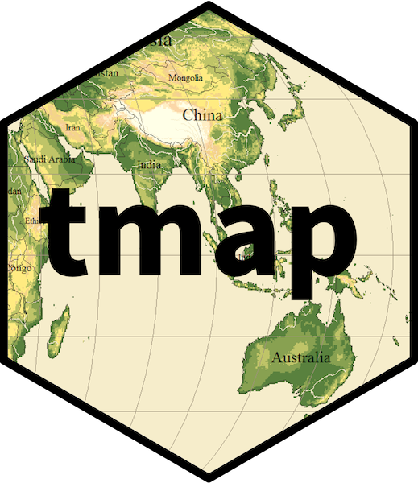

```{r setup, include=FALSE}
knitr::opts_chunk$set(echo = TRUE)
```

<a href="https://github.com/Animal-Movements/China_2025.git" class="github-corner" aria-label="View source on GitHub"><svg width="80" height="80" viewBox="0 0 250 250" style="fill:#151513; color:#fff; position: absolute; top: 0; border: 0; right: 0;" aria-hidden="true"><path d="M0,0 L115,115 L130,115 L142,142 L250,250 L250,0 Z"></path><path d="M128.3,109.0 C113.8,99.7 119.0,89.6 119.0,89.6 C122.0,82.7 120.5,78.6 120.5,78.6 C119.2,72.0 123.4,76.3 123.4,76.3 C127.3,80.9 125.5,87.3 125.5,87.3 C122.9,97.6 130.6,101.9 134.4,103.2" fill="currentColor" style="transform-origin: 130px 106px;" class="octo-arm"></path><path d="M115.0,115.0 C114.9,115.1 118.7,116.5 119.8,115.4 L133.7,101.6 C136.9,99.2 139.9,98.4 142.2,98.6 C133.8,88.0 127.5,74.4 143.8,58.0 C148.5,53.4 154.0,51.2 159.7,51.0 C160.3,49.4 163.2,43.6 171.4,40.1 C171.4,40.1 176.1,42.5 178.8,56.2 C183.1,58.6 187.2,61.8 190.9,65.4 C194.5,69.0 197.7,73.2 200.1,77.6 C213.8,80.2 216.3,84.9 216.3,84.9 C212.7,93.1 206.9,96.0 205.4,96.6 C205.1,102.4 203.0,107.8 198.3,112.5 C181.9,128.9 168.3,122.5 157.7,114.1 C157.9,116.9 156.7,120.9 152.7,124.9 L141.0,136.5 C139.8,137.7 141.6,141.9 141.8,141.8 Z" fill="currentColor" class="octo-body"></path></svg></a><style>.github-corner:hover .octo-arm{animation:octocat-wave 560ms ease-in-out}@keyframes octocat-wave{0%,100%{transform:rotate(0)}20%,60%{transform:rotate(-25deg)}40%,80%{transform:rotate(10deg)}}@media (max-width:500px){.github-corner:hover .octo-arm{animation:none}.github-corner .octo-arm{animation:octocat-wave 560ms ease-in-out}}</style>

# Introduction
  >Example: White-bearded wildebeest (2010-2013)
  
Throughout introductory exercises focused on discrete-time analyses, we will use a dataset collected during my PhD field research.  The dataset consists of 36 adult white-bearded wildebeest (*Connochaetes taurinus*) fitted with Lotek WildCell^TM^ GPS tracking devices that were monitored across three ecosystems (Amboseli Basin, Athi-Kaputiei Plains, and the Greater Maasai Mara) in southern Kenya from 2010-2013.  These data are freely available on [Movebank](https://www.movebank.org/), accessible without creating a Movebank account.  Known to be particularly important to ecosystem function and diversity, many resident populations of wildebeest have become threatened with extinction over the past few decades.  Study goals were to understand how natural and anthropogenic change impact the movements of wildebeest fitted with tracking devices.

<div style="float:right">

</div>

These data can be referenced as:

Stabach JA, Hughey LF, Crego RD, Fleming CH, Hopcraft JGC, Leimgruber P, Morrison TA, Ogutu JO, Reid RS, Worden JS, Boone RB. 2022. Increasing anthropogenic disturbance restricts wildebeest movement across East African grazing systems. Frontiers in Ecology and Evolution. [doi.org/10.3389/fevo.2022.846171](https://doi.org/10.3389/fevo.2022.846171)

Stabach JA, Hughey LF, Reid RS, Worden JS, Leimgruber P, Boone RB. 2020. Data from: Comparison of movement strategies of three populations of white-bearded wildebeest. Movebank Data Repository. [doi:10.5441/001/1.h0t27719](https://www.datarepository.movebank.org/handle/10255/move.1095)

In this exercise, you will:

  * Import and clean the animal movement trajectory for future analyses
  * Summarize and visualize movement path(s)

# Data Preparation
Here, we will prepare data for discrete time analyses.  As a first step, we must first clean the data received before taking any additional steps. This includes filtering the dataset for completeness, identifying duplicate records, removing invalid start or stop dates, identifying positions of poor data quality, and ordering the dataset sequentially.  Nearly all manufacturers report some type of positional quality, often reported as the type of position (e.g., 1D, 2D, or 3D) or Dilution of Position (DOP - horizontal or vertical).  Large DOPs indicate poor positional quality that can be filtered from the dataset.

## Load Libraries
Load the required libraries and remove everything held in [R's](https://cran.r-project.org/) memory.

```{r Clean Libraries, message=FALSE, warning=FALSE}
# Remove from memory
rm(list=ls())

# You may need to install these packages first
#install.packages('tidyverse', 'move2', 'lubridate', 'gt', 'sf', 'tmap')

# Load required libraries
library(tidyverse)
library(move2)
library(lubridate)
library(gt)
library(sf)
library(tmap)
```

## Set Time Zone & Coordinate System
I prefer to keep items that require user input to appear at the top of my scripts.  For me, this is helpful when transitioning between different studies because most of the introductory code is essentially the same. 
Data in this example were collected in Kenya.  We will create an object for UTC (Coordinated Universal Time) time, but import all data as East Africa Time (EAT).  See the [wiki](https://en.wikipedia.org/wiki/List_of_tz_database_time_zones) for your appropriate timezone identifier.

```{r Clean Timezone, message=FALSE, warning=FALSE}
# Set TimeZone
# Other timezones can be found at: https://en.wikipedia.org/wiki/List_of_tz_database_time_zones
Timezone1 <- 'UTC'
Timezone2 <- "Africa/Nairobi"
```

## Coordinate Systems and Projections

Spatial data collected using GPS devices or downloaded online must have a projection system that links the coordinates to specific locations on the earth’s surface. Without a coordinate reference system, there is no way to locate places to their location on Earth.  

Any geospatial data (e.g., a set of points) with an incorrect projection or with unknown projection system can be visualized on its own. However, you will not be able to plot that data with other spatial data, as the coordinate reference system is missing. Importantly, you will not be able to conduct any spatial analysis (e.g., calculate the distance of a given point to a road, or extract the value of the underlining raster value at the point locations), since the incorrectly projected (or unprojected) spatial data is pointing to a completely different location on earth than intended.

When you acquire or download geospatial data, make sure you know the projection of the data.  This information is usually found in the metadata of a given dataset or should be provided by the person that is sharing the data with you.

There are EPSG Codes that can be used to avoid manually setting all the parameters needed in a projection. For instance, the code EPSG:32637 references the UTM37N projection with WGS84 datum and ellipsoid. The code EPSG:32736 references UTM36S.  You can find the EPSG reference listed in [http://spatialreference.org/ref/epsg/]() and [https://epsg.io/]().

<center>
](Figures/projections-esri-blog.png){width=75%}
</center>
<br>

It is important to understand that projections try to minimize distortion of a 3-dimensional object (the earth) on a 2-dimensional surface (paper map or computer screen). Choosing a projection that minimizes this distortion is especially important when doing calculations of area or speed. I recommend collecting all GPS data in geographic coordinates and projecting data into a coordinate system that minimizes distortion of your objects of interest.  

The Universal Tranverse Mercator (UTM) projection is a common projection used for assigning coordinates to locations on the surface of the earth.  The UTM projection divides earth into 60 distinct zones, using the equator as the origin (0) and spanning 1,000,000 meters.  The center of the zone is defined as 500,000 meters.  As a result, you can identify any geographic point on earth to a specific UTM zone and meter coordinate.  

<center>
](Figures/Utm-zones.jpg){width=75%}
</center>
<br>

## Set Coordinate System
In this example, we will project all geographic data to the Universe Transverse Mercator (UTM) coordinate system, zone 37 south. The unit of measurement of this coordinate system is meters, advantageous for calculating relevant distances between sequential points in time. 

Identifying the correct UTM zones is relatively simple, with multiple options:

  1. Mathematical Approach
      + Take a longitudinal coordinate (or calculate the mean value) from your dataset and add 180.  Then divide by 6 and round up to the nearest whole number.
      + Example: -39 + 180 = 141 / 6 = 23.5 == 24
      + 39$^\circ$W is UTM zone 24.  Then simply determine if the point is above (N) or below (S) the equator.
  
  2. Check the PRJ File
      + Check a .prj file from a shapefile associated with your study area.   

  3. Download the World UTM Grid
      + ArcGIS (or similar GIS software) include downloadable [UTM Zones](https://hub.arcgis.com/datasets/esri::world-utm-grid/explore) data layers.  Loading this file with your point dataset will show you where your data overlap.

  4. Check the Zone Number in Google Earth (might be difficult in China)
      + Convert your dataset to a KMZ/KML file and load into Google Earth.  Be sure your units are set to UTMs in Google Earth.  The zone number will appear at the bottom center of your screen when you zoom into your file.
  
**NOTE**: The data we are using spans multiple UTM zones (UTM 36 south and UTM 37 south).  In this case, there is no problem because we will be subsetting our data, only using data that overlap with UTM 37 south.  Other coordinator systems, such as Lambert's or Alber's Equal-Area conic projections, could be used for datasets that span multiple UTM zones, minimizing distortion.  It's important to correctly input the parameters of your selected coordinate system.

```{r Set UTM Zone, message=FALSE, warning=FALSE}
# UTM Zone
LatLong.proj <- "+proj=longlat +ellps=WGS84 +datum=WGS84 +no_defs"  # EPSG:4326
#UtmZone.proj <- "+proj=utm +zone=37 +south +ellps=WGS84 +datum=WGS84 +units=m +no_defs" #This is EPSG:32737"
UtmZone.proj <- "EPSG:32737"
```

## Load Collar Data
All data for this exercise are freely available via [Movebank](https://www.movebank.org/). These data have already been downloaded and are available in your `/Data` folder as a `.csv`. Included is a reference file which was also downloaded from [Movebank](https://www.movebank.org/).  The reference file contains additional details (sex, age) about each animal and are common files that often need to be merged with the tracking data.  

Most important is that your movement dataset has the following variables:

1) Unique Animal ID
2) Timestamp
3) Coordinates (X/Y)

Since these data are available on [Movebank](https://www.movebank.org/) as open access, we don't need to provide any login details - we simply need to correctly specify the study id of interest.  Downloading directly from [Movebank](https://www.movebank.org/) is particularly useful when data continue to be collected (i.e., are actively streaming) on a study.  This ensures that you are always working with the most up-to-date dataset being collected.

```{r Load, message=FALSE, warning=FALSE}
# Pull Data from Movebank
WB <- movebank_download_study(study_id = "White-bearded wildebeest (Connochaetes taurinus) movements - Kenya") 

# You could use the output directly with functions in the move2 package.  Here, however, we will extract the X and Y coordinates and convert to a dataframe

# Using piping operations
WB <- WB %>% 
  as_tibble() %>% # A tibble is a dataframe of dataframes 
  mutate(longitude = st_coordinates(WB)[,1], # Pull out the X coordinates
         latitude = st_coordinates(WB)[,2]) %>% # Pull out the y coordinates
  select(-geometry) %>% # Remove the geometry
  data.frame() # Make it a dataframe

# Reference Dataset, import and convert to dataframe
WB.ref <- data.frame(movebank_download_deployment(study_id = "White-bearded wildebeest (Connochaetes taurinus) movements - Kenya"))

#**NOTE**: If data are protected and you need to provide your login details, you could do the following:

# Use the svDialogs library to add a pop-up to your code so that you can add your Username and Password as you run your script
#library(svDialogs)

# Set Movebank Login Details
#UN <- dlgInput("Enter Movebank UserName: ", Sys.info()[""])$res
#PW <- dlgInput("Enter Movebank Password: ", Sys.info()[""])$res

# Details
#login <- movebank_store_credentials(username=UN, password=PW)

# Then do the same as before, but add your login details
#WB <- as.data.frame(movebank_download_study(study_id = "White-bearded wildebeest (Connochaetes taurinus) movements - Kenya", login = login))

# Reference Dataset
#WB.ref <- as.data.frame(movebank_download_deployment(study_id = "White-bearded wildebeest (Connochaetes taurinus) movements - Kenya", login = login))

# **********************
# **********************

# Alternatively, we can upload each file directly and convert to a dataframe using the 'read_csv()' function 

#WB <- data.frame(read_csv("Data/WB_FullDataset.csv"))
#WB.ref <- data.frame(read_csv("Data/WB_FullDataset_ref.csv"))

#**NOTE**: If you open the file provided in Excel, do NOT save the file before loading it in R. Excel will change the timestamp column and set it to the time on your computer - obviously not what you want for most studies.

# You could also list the files so you don't need to type so much
# Create list
#lf <- list.files(path="Data/", pattern = '.csv', all.files=FALSE, full.names=TRUE)
#lf

#WB <- as.data.frame(read_csv(lf[2]))
#WB.ref <- as.data.frame(read_csv(lf[1]))

# **********************
# **********************

# Look at the data
head(WB)
head(WB.ref)
```

## Dataframe Verification
It's always good practice to look at your data and make sure the dataset has been uploaded correctly.  We should have `r length(unique(WB$individual_local_identifier))` animals across `r length(unique(WB.ref$study_site))` distinct ecosystems.  The timezone should be UTC. We can also use some simple commands to summarize the dataset, including:

* `head()` to view the first few lines of the data object
* `tail()` to view the last few lines of the data object
* `dim()` to print the dimensions of the data object (i.e., rows and columns)
* `str()` to provide the structure of the data object

**Questions :**

* How would you view the first or last few lines of the dataset?  What would you do to view the first 10 rows?
* What is the structure of the dataset?  What is the data type of the timestamp column?
* How many rows and columns are there in the movement dataset?
* What tags are included in the study?  How many?
* How many study areas are included in the dataset?  What are the study area names?
* What is the timezone of the dataset? (Hint: There is a function in the lubridate package)

```{r Verify, message=FALSE, warning=FALSE, results='hide', echo=FALSE}
# View the dataset
head(WB)
tail(WB)
head(WB, 10)
WB[1:10,]

# What is the structure of the dataset?
# What is the data type of the time stamp column?
str(WB)
str(WB$timestamp)
str(WB.ref)

# How many rows and columns are there in the movement dataset?
dim(WB)
nrow(WB)
ncol(WB)

# How many tags?
sort(unique(WB$individual_local_identifier))
length(unique(WB$individual_local_identifier))

# How many study sites?  What are there names?
length(unique(WB.ref$study_site))
unique(WB.ref$study_site)

# What is the timezone of the dataset?
tz(WB$timestamp)
```

## Dataframe Organization & Cleaning
Many of the dataframe columns included are unnecessary (and quite long).  We need to clean and filter the data. To do so, we will use 'piping' (e.g., %>%) from the [tidyverse](https://cran.r-project.org/web/packages/tidyverse/index.html) package.  This allows us to combine multiple sequential commands together.

Here, we will clean the data, filter out unnecessary information, and update the timezone to the local timezone.  We will then subset (i.e., filter) the start/end dates for each animal to match what has been recorded in our reference dataset.  These dates represent the dates that the collar was deployed on the animal. To join the dataframes, we will match records based on a shared primary key (i.e., id). Lastly, we will check on the completeness of the dataset and remove any (grossly) erroneous data points.

**NOTE**: date/time fields can often present issues and be difficult to import.  If problems exist, you may need to properly format the date/time fields first.  See the [lubridate](https://cran.r-project.org/web/packages/lubridate/index.html) package for some instructions and/or the [strptime](https://www.rdocumentation.org/packages/base/versions/3.6.2/topics/strptime) package to format your date/time field. Note the format of **YOUR** own dataset (e.g., "%Y-%m-%d %H:%M:%S").  

Also note that some manufacturers put the date and time in separate columns.  If this occurs with your dataset, you'll need to put these columns together to create a timestamp.  For example, `timestamp = ymd_hms(paste(date,time),tz = 'Africa/Nairobi')`.

```{r Clean Merge, message=FALSE, warning=FALSE, echo=TRUE}
# Clean the reference file, selecting only the columns that you want to include
WB <- # Note, this will overwrite your existing dataset
  WB %>% 
 
  # Pull in the WB.ref dataset, joining by a key field
  left_join(WB.ref, by = join_by("individual_local_identifier" == "individual_local_identifier")) %>%

  # Select columns of interest, rename if necessary
  mutate(id = tag_local_identifier,
         animal_id = individual_local_identifier,
         latitude,
         longitude,
         sex,
         DOP = gps_dop,
         fixType = gps_fix_type_raw,
         temp = external_temperature,
         # Setting my timestaps to Timezone2 -> EAT
         # Your timestamp might be in two different fields and is potentially collected in a different time stamp (i.e., UTC)
         #timestamp = dmy_hms(paste(date, time), tz=Timezone1), # Convert to date/time
         timestamp = with_tz(timestamp, tz=Timezone2),
         deploy_on = with_tz(deploy_on_timestamp, tz=Timezone2),
         deploy_off = with_tz(deploy_off_timestamp, tz=Timezone2),
         study_site,
         .keep = "none") %>% 

  # The 'across' function allows me to apply a function (as.factor) across multiple fields 
  mutate(across(c(id,sex,study_site), as.factor)) %>%

  # Make sure no duplicate id and timestamp exist.
  distinct(animal_id, timestamp, .keep_all = TRUE) %>%

  # Remove any records that don't have a timestamp or a Lat/Long location
  filter(!is.na(timestamp),
         !is.na(latitude),
         !is.na(longitude),
         latitude != 0,
         longitude != 0,

         # Subset: Grab only the Athi-Kaputiei Data
         study_site == "Athi-Kaputiei Plains",

         # And use the deploy on and off dates to further subset
         timestamp >= deploy_on & timestamp <= deploy_off) %>%

  # Remove fields that are now unnecessary - > remove deployment fields
  dplyr::select(-c(deploy_on, deploy_off)) %>%
  
  # Remove extra levels (important since subsetting to a single study area)
  # The droplevels function re-assess what levels are in the data and drops the rest
  droplevels() %>%

  # Arrange the dataset by id and timestamp
  arrange(id, timestamp)

# Look again (yes again!) at your data
head(WB)
```

**Questions:**

* How many records exist in the dataset now?
* Are all the columns in the expected/required format?
* What are the unique animals in the dataset?  How many?
* Has the timezone changed?

```{r Clean Verify, message=FALSE, warning=FALSE, results='hide', echo=FALSE}
# How many records
dim(WB)
nrow(WB)

# What is the structure of the dataset?
str(WB)

# How many tags?
sort(unique(WB$animal_id))
length(unique(WB$animal_id))

# What is the timezone of the dataset?
tz(WB$timestamp) 
```

# Summarize
To summarize results, we can easily provide a table of all data collected.  We will convert our summarized results to a `gt` table, providing output that could be shared on a website or with your supervisor. 

```{r Summarize, message=FALSE, warning=FALSE, echo=TRUE}
# Create summary object
wb.Summary <- WB %>% 
  
  summarize(
    Locations = n(),
    Sex = unique(sex),
    Start = min(timestamp),
    End = max(timestamp),
    Duration = round(End - Start, digits = 1),
    .by = animal_id) %>% 
  
  # Arrange results
  arrange(animal_id, Start, desc(Locations))

# Print Results
wb.Summary

# Now make prettier, saving the results to your Output folder 
gt_gnu <- wb.Summary %>% 
  
  # initialize gt table
  gt() %>%
  
  # Make the table easier to read with alternating grey bars
  opt_row_striping() %>%
  
  # Add title and subtitle, pulling date of creation
  tab_header(
    title = "White-bearded Wildebeest in Kenya: Tracking Data Summary",
    subtitle = Sys.Date()) %>%
  
  # Easy preset date formatting
  fmt_date(
    columns = c(Start, End),
    date_style = 8) %>%
  
  # Change the column labels for the table
  cols_label(animal_id = "Wildebeest ID",
             Sex = "Sex",
             Locations = "Total points",
             Start = "First location",
             End = "Last location",
             Duration = "Tracking period (days)") %>%
  
  # Center text inside columns
  cols_align(align = "center") 

# Print result
gt_gnu

# Save as html table to send to the project manager, or a shiny app
gtsave(gt_gnu, filename = "Output/summary_gnu.html")
```

# Visualize
Now that the data have been imported and some preliminary cleaning has been done, let's visualize the data.  This is often a good, first check to determine if everything has been imported correctly.  Here, we will:

* Create a simple plot
* Convert the dataframe to a spatial object by transforming the data to UTMs
* Display the data on top of available basemaps

## Create a Simple Plot
Plot the x and y coordinates (i.e., right now, the data are not spatial).
```{r Visualize, message=FALSE, warning=FALSE, echo=TRUE}
# Create very simple plot (non-spatial)
plot(WB$longitude, WB$latitude,
     col = WB$id,
     pch = 16,
     cex = 0.5,
     ylab = 'Latitude',
     xlab = 'Longitude',
     asp = 1)
```

## Make it Spatial

There are two main packages in R to handle geospatial vector data: the `sp` package and the `sf` package.

The first package to provide classes and methods for spatial data types in R is called `sp`. Development began in the early 2000s, in an attempt to standardize how spatial data would be treated and to allow for better interoperability between different analysis packages that use spatial data. The package (first released on CRAN in 2005) provides classes and methods to create points, lines, polygons, and grids, with functions to work with them.  About 350 packages developed for spatial analysis use the data types implemented in `sp`, which means several spatial packages “depend” on the `sp` package in some way.

The `sp` package depends on `rgeos` and `rgdal`. However at the end of 2023, these packages were retired, primarily because their maintainer, Roger Bivand, also retired. You can read more about it [here](https://r-spatial.org/r/2022/04/12/evolution.html).

All geospatial work in R is being replaced by the more modern package `sf`. `sf` was first released on CRAN in late October 2016. It implements a formal standard called “Simple Features” that specifies a storage and access model of spatial geometries (i.e. points, lines, polygons).  `sf` provides fast I/O, particularly relevant for large files.

## The `sf` Package

The `sf` class is an extension of a dataframe. Essentially, `sf` objects can be treated as dataframes that also contain spatial data, as opposed to spatial data that may or may not also contain data frames. This enables `sf` objects to fit within the `tidyverse` workflow, making it possible to manipulate them with the `dplyr` commands we used previously.

`sf` objects consist of rows of features, hence the name “simple features (`sf`)”, which have both non-spatial and spatial data formats.  The spatial data of an `sf` object is contained in a special geometry column that is of class ‘sfc - simple features class’. The geometry column contains the basic types of spatial data: the Coordinate Reference System (CRS), coordinates, and type of geometric object.

The ‘sfc’ class has seven subclasses to denote the types of geometric objects within the geometry column, which are derived from the simple features standard. The possible geometric objects are point, linestring, polygon, multipoint, multilinestring, multipolygon, and geometrycollection, which is used for any combination of the other types.

](Figures/AllisonHorst_sf.png)

<br>

## Convert a Dataframe to a `sf` Object

Convert the dataframe to a [sf](https://cran.r-project.org/web/packages/sf/index.html) simple features object and plot.  Note the structure of the object once it has been converted to a spatial object.

We will then use the function `st_as_sf()` that requires a vector of coordinates to be input to the ‘coords’ argument and an EPSG code or a PROJ definition for the crs. We can import the file just like any other data file and then make the data file a `sf` object. Note, we will use the function `st_transform()` to reproject the geographic data (Latitude/Longitude) to UTMs.

**Important**: There is an important distinction between 'Setting a Project' and 'Re-projecting an object' to a new projection.  Only use `st_transform()` to project or transform your object from a known coordinate system or projection to another (e.g., Geographic coordinates to UTM projection). `sf::st_crs()` should only be used to retrieve or set your existing coordinate reference system.  Using `st::st_crs()` to erroneously re-project your data would be akin to setting a new home address without actually moving to this new location. 

```{r Visualize1, message=FALSE, warning=FALSE, echo=TRUE}
# Convert
WB.sf <- WB %>% 
  st_as_sf(coords = c('longitude', 'latitude'), 
           crs = LatLong.proj) %>% 
  st_transform(UtmZone.proj)

# You could check the coordinate system by:
#st_crs(WB.sf)

# Look at the data
#head(WB.sf)
#str(WB.sf)
class(WB.sf)
```

## Plot the Spatial Object
Now plot the spatial object using [ggplot](https://cran.r-project.org/web/packages/ggplot2/index.html), which has some nice features for plotting.

```{r Visualize2, message=FALSE, warning=FALSE, echo=TRUE}
# Plot using basic R function
# plot(WB.sf["animal_id"],
#      main = paste("Wildebeest: Athi-Kaputiei Plains ( n = ", length(unique(WB.sf$animal_id)),")"))

# GGPlot using the spatial object
WB.sf %>%
  ggplot() +
  geom_sf(aes(fill = animal_id),
          alpha = 0.6,
          shape = 21,
          col = "black") +
  scale_fill_discrete(name = "Animal ID") +
  ggtitle(paste("Wildebeest: Athi-Kaputiei Plains (n =", length(unique(WB.sf$animal_id)),")")) +
  coord_sf(datum = st_crs(UtmZone.proj)) + # Note, this line is necessary unless we want the data plotted in Lat/Long
  theme_minimal()

# or use the facet_wrap command to separate each individual into its own plot
# This is perhaps a bit more useful to look for potential errant points for each individual.
# WB.sf %>%
#   ggplot() +
#   geom_sf(aes(fill = animal_id),
#           alpha = 0.6,
#           shape = 21,
#           col = "black") +
#   scale_fill_discrete(name = "Animal ID") +
#   theme_minimal() +
#   facet_wrap(~ animal_id)
```

## Tmap Plotting
Perhaps more useful is plotting the data on top of available satellite or background basemaps.  This way, we can determine if the data are where they should be.  We will use [tmap](https://cran.r-project.org/web/packages/tmap/index.html) to plot the wildebeest data and upload a shapefile boundary of Nairobi National Park to display with the point data. We'll also convert the wildebeest points to lines for graphing purposes. 

Tmap includes a variety of basemaps (see a list [here](https://leaflet-extras.github.io/leaflet-providers/preview/)) and can be used in "view" (known as "interactive" mode) or "plot" mode.  Plot mode is better for making static maps. 

The basic building block in `tmap` is `tm_shape()`, which creates a tmap-element that defines input data as vector or raster objects. We then add one or more layer elements, such as `tm_fill()`, `tm_borders()`, `tm_dots()`, `tm_raster()`, depending on the data type.  `Tmap` syntax involves separating between the input data and the aesthetics for data visualization. Each input dataset can be displayed in many different ways, largely dependent on whether the data object is a raster, point, line, or polygon layer.  We can link different commands in `tmap` by adding them (`+`) together.

<div style="float:right">

</div>

While in interactive mode, you can zoom in to investigate points from a particular animal. You can also toggle on and off the various basemap layers you have included using the tile icon in the top left corner. Aesthetics of objects can be changed using either variable fields (data in your file) or constant values. The most commonly used aesthetics for fill and border layers include color, transparency, line width and line type, which are set with `col`, `alpha`, `lwd`, and `lty` arguments, respectively.  Most importantly, you can freely and easily access available basemaps to place as a background on the dat, using the function `tm_basemap()`.

`Tmap` also has a number of helpful vignettes to get products up and running, which can be found [here]( https://cran.r-project.org/web/packages/tmap/vignettes/tmap-getstarted.html).

```{r Visualize3, message=FALSE, warning=FALSE, echo=TRUE}
# Read in shapefile boundary of Nairobi National Park
# Data are projected to DD WGS84 and must be reprojected to UTM 37S, WGS
NNP <- st_read("Data/NNP_DDWGS84.shp", quiet = TRUE) %>% 
  st_transform(crs = UtmZone.proj)

# Convert the wildebeest spatial points to spatial lines (more accurately, a “LINESTRING”). We’ll use a few functions that we have yet to see and will use the summarise function to create an individual line (do_union=FALSE) for each animal we monitored with a tracking device.
WB.lines <- WB.sf %>% 
  group_by(id) %>% 
  dplyr::summarise(do_union=FALSE) %>% 
  st_cast("LINESTRING")

# Create color palette to use in graphing across individuals
col.pal <- viridis::viridis(length(unique(WB.sf$id)))

# Set tmap mode
tmap_mode("view")
 
# Select from a range of basemaps:.
# https://leaflet-extras.github.io/leaflet-providers/preview/
# You can also type "providers$" in the console to see all the options, but this won't allow you to easily preview them.

# We'll pull a world satellite map and a world street map.
# Note that the format of tmap requires us to refer to variables in quotes
# We'll also add the NNP boundary

Athi.Map <-
  tm_basemap(c("Esri.WorldImagery",
             "OpenStreetMap")) +
  
  # Display WB - points
  tm_shape(WB.sf,
           name = paste("Wildebeest: Athi-Kaputiei Plains (n =", length(unique(WB.sf$animal_id)),")")) +
    tm_dots(col = 'id', 
            palette = col.pal, 
            size = 0.001, # Size of the dots
            legend.show = TRUE) +
  
  # Load the wildebeest data - Lines
  tm_shape(WB.lines,
           name = "Wildebeest Tracks") +
  tm_lines(lwd = 0.25, 
           col = 'id',
           palette = col.pal,
           legend.col.show = FALSE) +

  # Display NNP boundary
  tm_shape(NNP,
           name = 'NNP') +
  tm_fill(col = 'green',
          alpha = 0.5) +
  tm_borders(col = 'green')

# Create the map
Athi.Map

# Save Output
tmap_save(Athi.Map, filename = "Output/Athi_GnuMap.html")
```

# Save
Save the dataframe files so that we can use them in future exercises.  We can write each file as a `.rds` file or save the files together, writing the data to a `.rdata` file.

```{r Save, message=FALSE, warning=FALSE, echo=TRUE}
# Save individual file
#write_rds(WB, file = "Data/wildebeest_WBonly.rds")
# or use saveRDS(object, file = "my_data.rds")

# Save both files together
save(WB, WB.sf, file = "Data/wildebeest_data.rdata")
```

# Exercise

Now that you have uploaded and manipulated the wildebeest data in [R](https://cran.r-project.org/), please adapt the code with your own data.  If your data are not on [Movebank](https://www.movebank.org/), you will need to use functions (e.g., 'read_csv') to import your movement dataset.  Please do the following:

1. Import your movement dataset into R
2. Check the coordinate reference system and re-project if necessary
3. Prepare a map of your study area