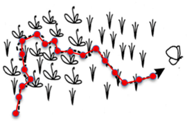
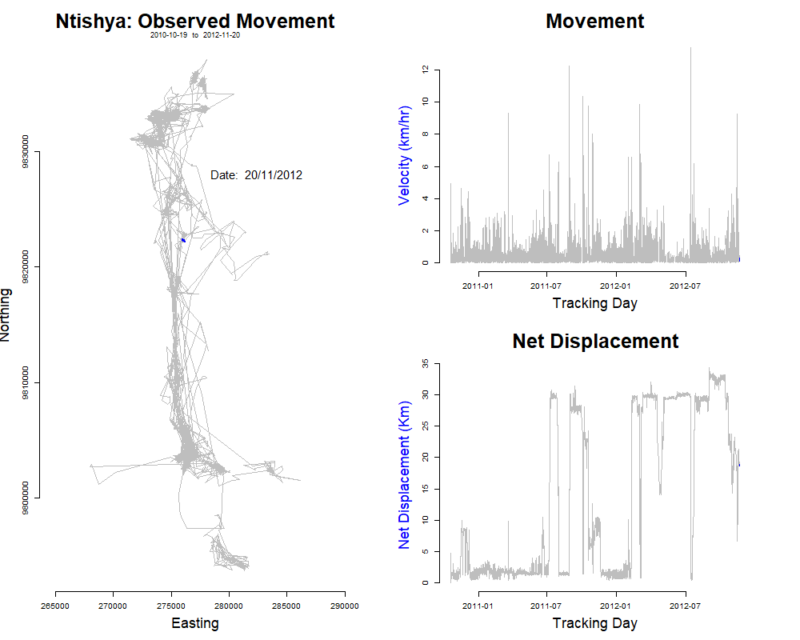

```{r setup, include=FALSE}
knitr::opts_chunk$set(echo = TRUE)
```

<a href="https://github.com/Animal-Movements/China_2025.git" class="github-corner" aria-label="View source on GitHub"><svg width="80" height="80" viewBox="0 0 250 250" style="fill:#151513; color:#fff; position: absolute; top: 0; border: 0; right: 0;" aria-hidden="true"><path d="M0,0 L115,115 L130,115 L142,142 L250,250 L250,0 Z"></path><path d="M128.3,109.0 C113.8,99.7 119.0,89.6 119.0,89.6 C122.0,82.7 120.5,78.6 120.5,78.6 C119.2,72.0 123.4,76.3 123.4,76.3 C127.3,80.9 125.5,87.3 125.5,87.3 C122.9,97.6 130.6,101.9 134.4,103.2" fill="currentColor" style="transform-origin: 130px 106px;" class="octo-arm"></path><path d="M115.0,115.0 C114.9,115.1 118.7,116.5 119.8,115.4 L133.7,101.6 C136.9,99.2 139.9,98.4 142.2,98.6 C133.8,88.0 127.5,74.4 143.8,58.0 C148.5,53.4 154.0,51.2 159.7,51.0 C160.3,49.4 163.2,43.6 171.4,40.1 C171.4,40.1 176.1,42.5 178.8,56.2 C183.1,58.6 187.2,61.8 190.9,65.4 C194.5,69.0 197.7,73.2 200.1,77.6 C213.8,80.2 216.3,84.9 216.3,84.9 C212.7,93.1 206.9,96.0 205.4,96.6 C205.1,102.4 203.0,107.8 198.3,112.5 C181.9,128.9 168.3,122.5 157.7,114.1 C157.9,116.9 156.7,120.9 152.7,124.9 L141.0,136.5 C139.8,137.7 141.6,141.9 141.8,141.8 Z" fill="currentColor" class="octo-body"></path></svg></a><style>.github-corner:hover .octo-arm{animation:octocat-wave 560ms ease-in-out}@keyframes octocat-wave{0%,100%{transform:rotate(0)}20%,60%{transform:rotate(-25deg)}40%,80%{transform:rotate(10deg)}}@media (max-width:500px){.github-corner:hover .octo-arm{animation:none}.github-corner .octo-arm{animation:octocat-wave 560ms ease-in-out}}</style>

# Introduction
Now that we have imported the wildebeest dataset for analysis and done some initial cleaning, we can take the necessary next steps to create an animal movement trajectory.  Most discrete time analyses require the data to be regularly sampled with negligible positional error.  Data **must** also be organized in sequential order.  

There are a number of [R](https://cran.r-project.org/) packages that can be used to convert our dataframe to an animal movement trajectory.  We will use the [adehabitatLT](https://cran.r-project.org/web/packages/adehabitatLT/index.html) and [amt - animal movement tools](https://cran.r-project.org/web/packages/amt/index.html) packages for all analyses described here.  The [move2](https://cran.r-project.org/web/packages/move2/index.html) package also has features that are worth exploring.  All packages differ in the commands and workflow used, but will provide the same end product for further analyses.  Please see the vignettes included with each package for further instruction.

I am most familiar with the [adehabitatLT](https://cran.r-project.org/web/packages/adehabitatLT/index.html) package and tend to default to using it for animal movement analyses.  [Amt](https://cran.r-project.org/web/packages/amt/index.html), however, has grown in its popularity over the last few years, using tracks as its basic building block.  One of the packages key strengths lies in its tidy, modular approach to construct movement workflows, with the coding structure lending itself well when transitioning to more complicated analyses (e.g., integrated Step Selection Functions (iSSFs)). 

<div style="float:right">

</div>

In this exercise, we will:

  * Investigate the [adehabitatLT](https://cran.r-project.org/web/packages/adehabitatLT/index.html) and [amt](https://cran.r-project.org/web/packages/amt/index.html) packages for analyzing animal movement data
  * Clean the animal movement trajectories and make the tracks 'regular'
  * Visualize plots & create a simple animation of animal movement

## Load Libraries
Load the required libraries and remove everything held in [R's](https://cran.r-project.org/) memory.

```{r Setup, message=FALSE, warning=FALSE, echo=TRUE}
# Remove items from memory/clean your workspace
rm(list=ls())

# You may need to install these packages first
#install.packages('adehabitatLT', 'amt', 'sf', 'tidyverse', 'unit', 'gridExtra', 'lubridate', 'date', 'gifski')

# Load libraries
library(adehabitatLT)
library(amt)
library(sf)
library(tidyverse)
library(units)
library(gridExtra)
library(lubridate)
library(date)
library(gifski)
```

## Data Import
Load the data from the previous exercise. Recall that the `.Rdata` file includes two files, `WB` and `WB.sf`.  The `WB.sf` file is essentially the same as the `WB` object, except data are projected (i.e., the data have spatial coordinates).  Let's use this file since we are ultimately interested in understanding how animal's are moving and need a coordinate system where we can evaluate distances between collected points. 

```{r Data Import, message=FALSE, warning=FALSE, echo=TRUE}
# Data load/import
load("Data/wildebeest_data.rdata")

# Check the projection.
# st_crs(WB.sf)

# AdeHabitatLT requires a dataframe for analyses.  This means we need to remove the geographic information from the header of the file.  We'll use the WB.sf dataset, converting the file to a flat dataframe with coordinate information contained in columns.

# Dataframe conversion
WB.data <- WB.sf %>%
  as_tibble() %>%
  mutate(X = st_coordinates(WB.sf)[,1],
         Y = st_coordinates(WB.sf)[,2]) %>%
  dplyr::select(-geometry) %>% 
  drop_units()

# Look at the data. How does this file differ from the WB.sf object?
head(WB.data)
```

# Data Quality & Summary
Nearly all telemetry datasets have some sort of data quality flag included with the recorded positions. Since every manufacturer has different ways to report error, you’ll have to familiarize yourself with your own dataset. Some manufacturers, for example, report SPS (Standard Positioning System) or DGPS (Differential GPS) positions, while others report a measure of the type of positions (e.g., 1D, 2D, 3D). Best is when manufacturers report a Dilution of Precision (DOP). 

The GPS collar manufacturer in this study (Lotek Wireless) provide data with a DOP measure. A good recommendation is to place your GPS device in a stationary location with an open constellation before fitting the device on an animal.  Save these data to provide the calibration information to assess GPS error (i.e., How much GPS scattering exists?).  The error associated with positions is often device or even batch specific.  Here, I’ll show a very basic way of filtering poor quality data points, although many other options exist (e.g., speed-based filtering).  Always be careful when filtering out data from further analysis.

```{r DOP, message=FALSE, warning=FALSE, echo=TRUE}
# Plot the DOP values for confirmation.  
# For this dataset, we will separate 2D and 3D positions and then use a qualitative filter to remove data above a threshold.  We will be more restrictive on 2D positions (dop < 5.0) than 3D positions (dop < 10.0).

# Let's first get a summary of how many records are in the dataset before removing records.  This way we can track how much this filtering impacts the size of the dataset.
(val1 <- nrow(WB.data))

# Plot 2D  and then 3D positions
P1.FT2 <- 
  ggplot(WB.data[WB.data$fixType == "2D",], aes(x = DOP)) +
  geom_histogram(color = "black", fill = "white", bins = 25) +
  labs(title = "GPS Data (2D)", x = "DOP", y = "Frequency") +
  geom_vline(xintercept = 5, color = "red", linetype = "dotted", linewidth = 1) +
  theme_classic()

# Plot 3D positions (most of data)
P1.FT3 <- 
  ggplot(WB.data[WB.data$fixType == "3D",], aes(x = DOP)) +
  geom_histogram(color = "black", fill = "white", bins = 25) +
  labs(title = "GPS Data (3D)", x = "DOP", y = "Frequency") +
  geom_vline(xintercept = 10, color = "red", linetype = "dotted", linewidth = 1) +
  theme_classic()

# Create filter to only accept positions with a 3D fixtype and DOP less than 10 or a 2D fixtype and DOP less than 5
WB.data <- 
  WB.data %>% 
  filter(
    fixType == "3D" & DOP < 10 | fixType == "2D" & DOP < 5) 

# How many records now after filtering?
(val2 <- nrow(WB.data))

# Plot again
P2.FT2 <- 
  ggplot(WB.data[WB.data$fixType == "2D",], aes(x = DOP)) +
  geom_histogram(color = "black", fill = "white", bins = 25) +
  labs(title = "GPS Data (2D) - DOP Filtered", x = "DOP", y = "Frequency") +
  geom_vline(xintercept = 5, color = "red", linetype = "dotted", linewidth = 1) +
  theme_classic()

P2.FT3 <- 
  ggplot(WB.data[WB.data$fixType == "3D",], aes(x = DOP)) +
  geom_histogram(color = "black", fill = "white", bins = 25) +
  labs(title = "GPS Data (3D) - DOP Filtered", x = "DOP", y = "Frequency") +
  geom_vline(xintercept = 10, color = "red", linetype = "dotted", linewidth = 1) +
  theme_classic()

# Plot the data together
grid.arrange(P1.FT2, P2.FT2, P1.FT3, P2.FT3, ncol = 2)

# What's the percent of data that have been removed?
round((val1-val2)/val1, digits = 4)
```

# Create Animal Trajectory - Adehabitat
An animal track in the [adehabitatLT](https://cran.r-project.org/web/packages/adehabitatLT/index.html) package is referred to as a trajectory. Type II trajectories are those for which each location is associated with a recorded time. The data input needs to be a dataframe with xy coordinates. 

We will use the `as.ltraj` function to create individual animal trajectories and use the `infolocs` command to include attributes of the data that we want to maintain/use later. The `slsp` argument indicates how to deal with turning angles when successive locations are in the same place. See the `help` menu for additional details.

```{r Trajectory, message=FALSE, warning=FALSE, echo=TRUE}
# Let's check to make sure all observations are complete
all(complete.cases(WB.data))

# And check for duplicated timestamps
WB.data %>% 
  group_by(id) %>% 
  summarise(any(duplicated(timestamp)))

# If duplicates exists, you need to remove them before moving forward
#WB.data <- WB.data[!duplicated(WB.data),c('id','timestamp')]

# Create a separate dataframe object with the X and Y coordinates to use with the as.ltraj function
XY <- WB.data %>% 
  dplyr::select(X:Y) %>% 
  as.data.frame()

# Create trajectory
WB.traj <-as.ltraj(xy = XY,
                       date = WB.data$timestamp,
                       id = WB.data$animal_id,
                       typeII = TRUE, 
                       infolocs = WB.data[,3:8],
                       slsp = "missing")

# Look at the summary of the created object
WB.traj
```

## Resampling the Trajectory
The summary of the trajectory above highlights that no NAs exist in our entire dataframe.  This is because the function `as.ltraj` does not recognize the movement interval and therefore, does not recognize that there may have been times in which data were missed/not collected.  In [adehabitatLT](https://cran.r-project.org/web/packages/adehabitatLT/index.html), the fix interval is a parameter we must manually set.  

Also note that the dataset summary indicates that our data were collected irregularly, with a variable time lag between two locations (i.e., every hour between 0600 and 1800 and every three hours from 1800 to 0600 (local time)).  Many discrete time analyses require a regular trajectory.  As a result, we will resample all the data to a 3-hour interval.  This means we will lose some data in the process.  To resample the data, we must use a two step process:

  1. Resample the data to a 3-hour interval and set all no data records to NA using the `setNA()` function.  
  2. Round all the times to the exact time interval (i.e., make the trajectory regular) using the `sett0()` function.
  
```{r Wenjing Subset, eval=FALSE, echo=FALSE}
# Creating an hourly subset for Wenjing
WB.sub <- WB.data %>% 
  mutate(
    hour = hour(timestamp),
    .keep = "all"
  ) %>% 
  filter(
    hour >= 8 & hour <= 18
  )

# Extract the X and Y coordinates to input into as.ltraj
XY <- WB.sub %>% 
  dplyr::select(X:Y) %>% 
  as.data.frame()

# Create trajectory
WB.traj.sub <-as.ltraj(xy = XY,
                       date = WB.sub$timestamp,
                       id = WB.sub$animal_id,
                       typeII = TRUE, 
                       infolocs = WB.sub[ ,3:8],
                       slsp = "missing")

# Set reference date/time
refda <- WB.traj.sub[[1]]$date[1]

# Set all null values to NA.  Based on 3 hour interval.
WB.traj.na.sub <- setNA(WB.traj.sub, 
                    date.ref = refda, 
                    dt = 1, 
                    units = "hour") 

# Create a regular trajectory by rounding the time to the exact time intervals.
WB.traj.reg.sub <- sett0(WB.traj.na.sub, 
                      date.ref = refda, 
                      dt = 1, 
                      units = "hour")

# Export
write_rds(WB.traj.reg.sub, file = "Data/wildebeest_WB_Hourly.rds")
```

```{r Resample, message=FALSE, warning=FALSE, echo=TRUE}
# Here, we will use the first location in the dataset as the reference date/time.  
# Set reference date/time
refda <- WB.traj[[1]]$date[1]

# Set all null values to NA.  Based on 3 hour interval.
WB.traj.na <- setNA(WB.traj, 
                    date.ref = refda, 
                    dt = 3, 
                    units = "hour") 

# Summarize the new dataset
# WB.traj.na

# Is the trajectory regular?
is.regular(WB.traj.na)

# Create a regular trajectory by rounding the time to the exact time intervals.
WB.traj.reg <- sett0(WB.traj.na, 
                      date.ref = refda, 
                      dt = 3, 
                      units = "hour")

# Summarize the new dataset
WB.traj.reg

# Is the trajectory regular?
is.regular(WB.traj.reg)
```

## Summarize the Trajectory
We can use the `summary` function to provide general summary statistics of the data collection period (i.e., how the collars functioned).  We can also add other summary metrics of interest and create some basic plots to familiarize ourselves with the movements of each animal.  This is sometimes helpful to identify issues in the dataset that need further attention.

```{r Summarize, message=FALSE, warning=FALSE, echo=TRUE}
# Summarize the movement trajectory
Summary.traj <- summary(WB.traj.reg)

# Note that nb.reloc is the total number of relocations collected at a 3 Hour sampling interval.  Any missing data have been filled with NA, allowing us to calculate the percent complete. 

# Add details to the summary table
Summary.traj <-
  Summary.traj %>% 
  mutate(
    Duration = round(difftime(date.end, 
                              date.begin,
                              units = "days"),
                     digits = 2),
    Records = nb.reloc - NAs,
    PctComplete = round((Records/nb.reloc)*100,
                        digits = 2))

# View the table
Summary.traj
```

## Generic Plotting
[AdehabitatLT](https://cran.r-project.org/web/packages/adehabitatLT/index.html) has a number of plotting options for visualizing the animal movement trajectory.  These plots can be very useful to identify potential problems in the data and inform potential research questions.

```{r Plotting, message=FALSE, warning=FALSE, echo=TRUE}
# Plot all animals together, helpful since all animals are plotted on the same scale.
plot(WB.traj.reg)

# View each animal separately using vector notation
plot(WB.traj.reg[5])

# We can also specify the name of the animals we want to plot.  For example:
# plot(WB.traj, 
#      id = c("Kikaya", "Karbolo", "Peria", "Sotua"))

# View the columns included in the data object 
#**Note**, you must use double brackets [[]] because the output is a list
#names(WB.traj.reg[[1]])
#head(WB.traj.reg[[1]])

# Contents of the ltraj object:
# dt: time between locations in seconds
# dist: distance between the next location
# R2n: net squared displacement
# abs.angle: absolute turning angle
# rel.angle: relative turning angle
# dx and dy represent the change in the x and y directions.

# A variety of additional plotting options also exist in the package.  See help(plotltr).
#plotltr(WB.traj.reg[5], which = "dist") # Distance moved between discrete points (3 hour interval)
#plotltr(WB.traj.reg[5], which = "dt/60") # This shows that the data are regular.  y-axis corrected (dt/60) to show minutes
#plotltr(WB.traj.reg[5], which = "DOP") # DOP.  As expected, all values are < 10 DOP.
```

## Custom Plotting - Single Individual
We can also create our own custom plots. This gives us greater flexibility to explore specific items.  Here, I provide a simple example of a movement trajectory that I commonly create, which includes graphing the animal points, the distance moved, and how far the animal moved from an initial location (NSD - Net Squared Displacement).  We will learn more about NSD in the next lecture.  I highly recommend plotting your data and spending time looking at each animal's movement trajectory.  

[AdehabitatLT](https://cran.r-project.org/web/packages/adehabitatLT/index.html) has a nice function (i.e., `ld()`) that converts the trajectory into a dataframe.  We'll need to do that here so that we can easily summarize and plot the data.  This function converts the `as.ltraj` object to a dataframe.

```{r Plotting2, message=FALSE, warning=FALSE, echo=TRUE}
# Here I will use basic R plotting functions
# This same workflow, however, could be adopted using GGPLot (A good homework assignment!)

# Convert trajectory to a flat dataframe (all data appended into a single file)
WB.move <- ld(WB.traj.reg)

# Create a reference id so can switch easily between individuals
Id.val <- unique(WB.move$id)
 
# Determine which animal you want to plot.  Here, I will plot the 5th animal in the object we created above
i <- 5

# Subset the data to our animal of interest and remove NAs from the dataset
WB.sub <- WB.move %>% 
  filter(id == Id.val[i],
         !is.na(x))

# Calculate the total days tracked
time.diff <- WB.sub %>% 
  summarize(start = min(date),
            end = max(date),
            diff = trunc(difftime(end, start, units="days"))) %>%  
  pull(diff) # This will make the time.diff variable = diff

# Setup a 2x2 plot layout with three panels
layout(matrix(c(1,1,2,3), 2, 2, byrow = FALSE), widths=1, heights=c(1,1))

# Plot the trajectory
plot(WB.sub$x,WB.sub$y,typ="l",xlab="Easting",ylab="Northing",
     main=paste(WB.sub$id[1],"Movement"),frame=FALSE,axes=FALSE,asp=1)
     mtext(paste(format(WB.sub$date[1],"%Y-%m-%d")," to ",format(WB.sub$date[nrow(WB.sub)],"%Y-%m-%d")),cex=0.75) # Just specifying how I want the dates to be reported
     axis(1, labels=TRUE)
     axis(2, labels=TRUE)
     # Color the points
     points(WB.sub$x,WB.sub$y,pch=16,cex=0.5,col="blue")  # All points Blue
     points(WB.sub$x[1],WB.sub$y[1],pch=17,cex=1,col="green") # Starting point Green
     points(WB.sub$x[nrow(WB.sub)],WB.sub$y[nrow(WB.sub)],pch=15,cex=1,col="red") # End point Red

# Plot the movements over time (Velocity)
plot(WB.sub$date, WB.sub$dist/1000, type='l', ylab="Distance moved (km)", xlab="Time", main="Steplengths (3-hour)", frame=FALSE)
    # Calculate the time from release date
    mtext(paste(time.diff,"days"),cex=0.75)
    
# Plot the net displacement per step
plot(WB.sub$date, sqrt(WB.sub$R2n)/1000, type='l', ylab="Distance (km)", xlab="Days Since Release", main="Net Displacement",frame=FALSE)
    mtext(paste(time.diff,"days"),cex=0.75)

# Same graph, but using ggplot    
# ggplot(data = WB.sub,
#        aes(x = date,
#            y = sqrt(R2n)/1000)) +
#   geom_line() +
#   labs(title = "Net Displacement") +
#   xlab("Days Since Release") +
#   ylab("Distance (km)")
```

## Custom Plotting - All individuals

We can adopt this code easily to "loop" across each individual, outputting results to a directory of our choosing.  See the 'Output/Plots' folder to view the graph created for each individual.  Much of the code is exactly the same as the code used above, with the small change of using a 'for' loop.  Note, that the `map` function could also be used to accomplish the same result.  See `help(map)` for more information.

```{r Plotting Loop, message=FALSE, warning=FALSE, echo=TRUE, eval=TRUE}
# Set Output Directory
dir.out <- paste0(getwd(),"/Output/Plots/")

# Create the directory if it doesn't exist
if (!dir.exists(dir.out)){
  dir.create(dir.out)
  print ("Creating Directory!")
} else {
  print("Directory exists!  Check the Output/Plots folder for results.")
}

# Now loop over each individual (by id) and save result
Id.val <- unique(WB.move$id)

# ------------------------------ 
for (i in 1:length(Id.val)){

# Subset the data to our animal of interest and remove NAs from the dataset
# ------------------------------
WB.sub <- WB.move %>% 
  filter(id == Id.val[i],
         !is.na(x))

# Calculate the total days tracked
time.diff <- WB.sub %>% 
  summarize(start = min(date),
            end = max(date),
            diff = trunc(difftime(end, start, units="days"))) %>%
  pull(diff)

# Create the output name of the plot...everything else in the code is the same
# ------------------------------
png(filename = paste0(dir.out,WB.sub$id[i],"_MvmtPlot.png"))
    
# Setup plot layout with three panels
layout(matrix(c(1,1,2,3), 2, 2, byrow = FALSE), widths=1, heights=c(1,1))

# Plot the trajectory
plot(WB.sub$x,WB.sub$y,typ="l",xlab="Easting",ylab="Northing",
     main=paste(WB.sub$id[1],"Movement"),frame=FALSE,axes=FALSE,asp=1)
     mtext(paste(format(WB.sub$date[1],"%Y-%m-%d")," to ",format(WB.sub$date[nrow(WB.sub)],"%Y-%m-%d")),cex=0.75) # Just specifying how I want the dates to be reported
     axis(1, labels=TRUE)
     axis(2, labels=TRUE)
     # Color the points
     points(WB.sub$x,WB.sub$y,pch=16,cex=0.5,col="blue")  # All points Blue
     points(WB.sub$x[1],WB.sub$y[1],pch=17,cex=1,col="green") # Starting point Green
     points(WB.sub$x[nrow(WB.sub)],WB.sub$y[nrow(WB.sub)],pch=15,cex=1,col="red") # End point Red

# Plot the movements over time (Velocity)
plot(WB.sub$date, WB.sub$dist/1000, type='l', ylab="Distance moved (km)", xlab="Time", main="Steplengths", frame=FALSE)
    # Calculate the time from release date
    mtext(paste(time.diff,"days"),cex=0.75)

# Plot the net displacement per step
plot(WB.sub$date, sqrt(WB.sub$R2n)/1000, type='l', ylab="Distance (km)", xlab="Days Since Release", main="Net Displacement",frame=FALSE)
    mtext(paste(time.diff,"days"),cex=0.75)

# Close the plot
# ------------------------------
dev.off()
}
```

# Create Animal Trajectory - Amt
Now we will perform the same procedure using the dataset we created above (`WB.data`), except using functions from the [amt](https://cran.r-project.org/web/packages/amt/index.html) package.  Because of the nested data structure of [amt](https://cran.r-project.org/web/packages/amt/index.html), there are some additional steps that are necessary to take.

To calculate movement metrics across datasets with multiple individuals, we need to:

  1. Nest the resulting track by the animal id, allowing us then group results together as a list.
  2. Perform operations on the group data column, using the `mutate()` and `map()` or `lapply()` functions.
  3. Select the relevant columns and unnest for further analysis.  
  
```{r AMT Track, message=FALSE, warning=FALSE, echo=TRUE, eval=TRUE}
# Step 1: Nest the Track by ID
WB.trk <- make_track(WB.data, 
                     .x = X, 
                     .y = Y, 
                     .t = timestamp,
                     crs = 32737, 
                     # Include any additional information you want to attach to the track or set "all_cols = TRUE"
                     id = animal_id, sex = sex, temp = temp) %>% 
  # Nest the data by id
  nest(data = -'id')

# Note, you could also import the geographic data and then transform the coordinate system
#WB.trk.New -> transform_coords(WB.trk, crs_to = SET, crs_from = SET)

# Look at the data and note the result
head(WB.trk)
#class(WB.trk)

# Step 2: Resample and add net squared displacement
# Note the use of the map() function.  Resample to a 3 hour interval
WB.steps <- WB.trk %>% 
  mutate(
    steps = map(data, function(x)
      # First, resample...applying the function to each nested item (id)
      x %>% track_resample( 
        rate = hours(3),
        tolerance = minutes(5)) %>% 
        # Then, calculate the steplengths
        steps_by_burst() %>% 
        # Net Square displacement can be added, along with various other metrics
        add_nsd()
      ))

# Look at the file now
head(WB.steps)

# Or, look at one of the animals
# You'll see the steplength (sl_), turning angle (ta_), change in time (dt_), and net squared displacement (nsd_)
#WB.steps$steps[1]

# Step 3: Select columns of interest and unnest
# We'll grab the animal id and then the calculated movements.  This means we will ignore the original data
WB.move.amt <- WB.steps %>% 
  # Select columns of interest
  select(id, steps) %>% 
  # Unnest
  unnest(cols = steps)

# This result should now be very similar to the result created from adehabitat
# We can graph the result as before, for example
# WB.Sotua <- WB.move.amt %>% 
#   filter(id == 'Sotua')
# 
# ggplot(data = WB.Sotua,
#        aes(x = t1_,
#            y = sqrt(nsd_)/1000)) +
#   geom_line() +
#   labs(title = "Net Displacement") +
#   xlab("Days Since Release") +
#   ylab("Distance (km)")
```

# Animating a Trajectory
We can now use either the [adehabitatLT](https://cran.r-project.org/web/packages/adehabitatLT/index.html) or [amt](https://cran.r-project.org/web/packages/amt/index.html) trajectory to create an animation of the movements of an animal on a daily time step.  To do so, we will create a graph for every day that the animal was tracked.  The outputs will then be aggregated in a gif.  If creating the outputs using [ggplot2](https://cran.r-project.org/web/packages/ggplot2/index.html), you could also use `gganimate()`.  See `help(gganimate)` for more information. 

[MoveVis](https://movevis.org) could also be explored, but is currently non-functional.

```{r Animate, message=FALSE, warning=FALSE, eval=FALSE, echo=TRUE, results='hide'}
# Set Output Directory
dir.out <- paste0(getwd(),"/Output/Animation/")

# Create the directory if it doesn't exist
if (!dir.exists(dir.out)){
  dir.create(dir.out)
  print ("Creating Directory!")
} else {
  print("Directory exists!  Check the Output/Plots folder for results.")
}

# Select the animal to animate and remove any NA values
WB.sub <- WB.move %>% 
  filter(id == "Ntishya",
         !is.na(x))

# Create a vector of Julian dates to use as our numeric value to animate
# This just makes it easier to iterate through the days
WB.sub$julian <- mdy.date(month(WB.sub$date), day(WB.sub$date), year(WB.sub$date))

# Create unique variable (day) to loop over for animation
Days.unique <- unique(WB.sub$julian)
	
# Create Null dataset to hold current day for display 	
Day.new <- NULL	

# Setup plot parameters - we need these to set the limits of each graph
# ----------------------------------------------------------------------
min.X <- min(WB.sub$x,na.rm=TRUE)
max.X <- max(WB.sub$x,na.rm=TRUE)
min.Y <- min(WB.sub$y,na.rm=TRUE)
max.Y <- max(WB.sub$y,na.rm=TRUE)

# Setup Title
Title1 = paste0(unique(WB.sub$id),": Observed Movement")
# ----------------------------------------------------------------------

# Loop through all days
# **************************************************
for (i in 1:length(Days.unique)){
  # Output each file to directory
  outfile = paste0(dir.out,"/Animation_",unique(WB.sub$id),"_",Days.unique[i],".png")
  png(file = outfile,width=1000, height=800)

  # Create subset of data to graph, stepping through each day, but includes all previous data
	Day.sub <- WB.sub %>% 
	  filter(julian <= Days.unique[i])

	# This part graphs the most current data in a different color...allows to be clearly seen in animation
	if(i==1)
		{Day.new <- Day.sub
		} else {
		  Day.new <- Day.sub %>% 
		    filter(julian == Days.unique[i]) # Note the subtle difference from above
		}
	
	# Grab the date to plot
	Date.txt <- Day.new[1,3]
	
	# Calculate the total days tracked
  time.diff <- Day.new %>% 
    summarize(start = min(WB.sub$date), # Get the data from the full dataset
              end = max(date),
              diff = trunc(difftime(end, start, units="days"))) %>%
    pull(diff)
         
  # Create plot
	plot(WB.sub$x,WB.sub$y,type="n",lwd=1.5,xlim=c(min.X,max.X),ylim=c(min.Y,max.Y),xlab="",ylab="",asp=1,bty="n",axes=FALSE,frame.plot=TRUE,main=Title1, cex.main = 1.5)
	mtext(paste(format(WB.sub$date[1],"%Y-%m-%d")," to ",format(WB.sub$date[nrow(WB.sub)],"%Y-%m-%d")),cex=0.75)
	Axis(side=1, labels=TRUE)
	Axis(side=2, labels=TRUE)
	lines(Day.sub$x,Day.sub$y,lwd=1,col="gray") # Graph all data in gray
	lines(Day.new$x,Day.new$y,lwd=2,col="blue") # Graph new data in blue
	mtext(side = 2,line=3, "Northing",cex=1.5,col="black")
	mtext(side = 1,line=3, "Easting",cex=1.5,col="black")
	# Plot the date
	text(min.X+10000,max.Y-10000, paste("Date: ",format(Date.txt, "%d/%m/%Y")),pos=4,cex=1.5)
	
dev.off()
}

# Then use Gifski to convert the .pngs to a .gif
All.files <- list.files(dir.out, pattern = "*.png", full.names = TRUE)
gifski(All.files, gif_file = paste(dir.out,"Wild.gif"), width = 1000, height = 800, delay = 0.1)

# Remove intermediary (.png) files
file.remove(All.files)
```

# Save Output
Save our cleaned dataframe for further analyses.  These are the files that we created in this exercise.

```{r Save, message=FALSE, warning=FALSE, echo=TRUE}
save(WB.move, WB.move.amt, file = "Data/wildebeest_3hr_adehabitat.rdata")
```

# Exercise:
The animal movement animation created above could be greatly improved by making the data spatial (see 1_DataCleaning.html), importing other spatial data layers, or overlaying movements on top of available satellite imagery.  Sometimes just as interesting is viewing the steplength and net displacement graphs with the animated trajectory.  

Using the wildebeest dataset or your own data, experiment with the generic plotting functions or with `ggplot()` to create a 3-panel figure like the image below.  Animate the movements on a daily time step, plotting the animal's trajectory, daily steplengths, and net squared displacement in separate windows.  Use the dataset in this exercise, with the ultimate goal of creating a similar graph with your own data.  Output the .gif to your output folder and delete all preliminary data files.  

The end result should look similar to the image below, although feel free to add other items of interest.

<div style="float:center">

</div>

```{r Animate Exercise, message=FALSE, warning=FALSE, eval=FALSE, echo=FALSE}
# Set Output Directory
dir.out <- paste0(getwd(),"/Output/Animation/")

# Create the directory if it doesn't exist
if (!dir.exists(dir.out)){
  dir.create(dir.out)
  print ("Creating Directory!")
} else {
  print("Directory exists!  Check the Output/Plots folder for results.")
}

# Select the animal to animate
WB.sub <- WB.move %>% 
  filter(id == "Ntishya",
         !is.na(x))

# Create a vector of Julian dates to use as our numeric value to animate
WB.sub$julian <- mdy.date(month(WB.sub$date), day(WB.sub$date), year(WB.sub$date))

# Create unique variable (day) to loop over for animation
Days.unique <- unique(WB.sub$julian)
	
# Create Null dataset to hold current day for display 	
Day.new <- NULL	

# Setup plot parameters - we need these to set the limits of each graph
# ----------------------------------------------------------------------
min.X <- min(WB.sub$x,na.rm=TRUE)
max.X <- max(WB.sub$x,na.rm=TRUE)
min.Y <- min(WB.sub$y,na.rm=TRUE)
max.Y <- max(WB.sub$y,na.rm=TRUE)

min.Time <- min(WB.sub$date,na.rm=TRUE)
max.Time <- max(WB.sub$date,na.rm=TRUE)

min.dist <-min(WB.sub$dist/1000,na.rm=TRUE) # km
max.dist <-max(WB.sub$dist/1000,na.rm=TRUE)

min.NSD <- min(sqrt(WB.sub$R2n)/1000,na.rm=TRUE) # km
max.NSD <- max(sqrt(WB.sub$R2n)/1000,na.rm=TRUE)

# Setup Titles
Title1 = paste0(unique(WB.sub$id),": Observed Movement")
Title2 = paste("Movement")
Title3 = paste("Net Displacement")
# ----------------------------------------------------------------------

# Loop through all days
# **************************************************
for (i in 1:length(Days.unique)){
  # Output each file to directory
  outfile = paste0(dir.out,"/Animation_",unique(WB.sub$id),"_",Days.unique[i],".png")
  png(file = outfile,width=1000, height=800)
  layout(matrix(c(1,1,2,3), 2, 2, byrow = FALSE), widths=1, heights=c(1,1))
         par(mar=c(5.1,4.1,4.1,5.1))
         
  # Create subset of data to graph, stepping through each day, but includes all previous data
	Day.sub <- WB.sub %>% 
	  filter(julian <= Days.unique[i])

	# This part graphs the most current data in a different color...allows to be clearly seen in animation
	if(i==1)
		{Day.new <- Day.sub
		} else {
		  Day.new <- Day.sub %>% 
		    filter(julian == Days.unique[i]) # Note the subtle difference from above
		}
	
	# Grab the date to plot
	Date.txt <- Day.new[1,3]
	
	# Calculate the total days tracked
  time.diff <- Day.new %>% 
    summarize(start = min(WB.sub$date), # Get the data from the full dataset
              end = max(date),
              diff = trunc(difftime(end, start, units="days"))) %>%
    pull(diff)
         
  # Create plots
	plot(WB.sub$x,WB.sub$y,type="n",lwd=1.5,xlim=c(min.X,max.X),ylim=c(min.Y,max.Y),xlab="",ylab="",asp=1,bty="n",axes=FALSE,frame.plot=TRUE,main=Title1, cex.main = 2.5)
	mtext(paste(format(WB.sub$date[1],"%Y-%m-%d")," to ",format(WB.sub$date[nrow(WB.sub)],"%Y-%m-%d")),cex=0.75)
	Axis(side=1, labels=TRUE)
	Axis(side=2, labels=TRUE)
	lines(Day.sub$x,Day.sub$y,lwd=1,col="gray") # Graph all data in gray
	lines(Day.new$x,Day.new$y,lwd=2,col="blue") # Graph new data in blue
	mtext(side = 2,line=3, "Northing",cex=1.5,col="black")
	mtext(side = 1,line=3, "Easting",cex=1.5,col="black")
	# Plot the date
	text(min.X+10000,max.Y-10000, paste("Date: ",format(Date.txt, "%d/%m/%Y")),pos=4,cex=1.5)
	
	# Plot the movements over time (Velocity)
  plot(WB.sub$date,WB.sub$dist/1000,type="n",lwd=1.5,xlim=c(min.Time,max.Time),ylim=c(min.dist,max.dist),bty="n",xlab="",ylab="",axes=TRUE,frame.plot=TRUE,main=Title2, cex.main = 2.5) 
	lines(Day.sub$date, Day.sub$dist/1000, type='l', col="gray")
	lines(Day.new$date, Day.new$dist/1000, type='l', col="blue")
	mtext(side = 2,line=3, "Velocity (km/hr)",cex=1.5,col="blue") # Remember that this is a 3 hour dataset
	mtext(side = 1,line=3, "Tracking Day",cex=1.5,col="black")

	# Plot the net displacement per step
	plot(WB.sub$date,sqrt(WB.sub$R2n)/1000,type="n",lwd=1.5,xlim=c(min.Time,max.Time),ylim=c(min.NSD,max.NSD),xlab="",ylab="",bty="n",axes=TRUE,frame.plot=TRUE,main=Title3, cex.main = 2.5) 
	lines(Day.sub$date, sqrt(Day.sub$R2n)/1000, type='l', col="gray", cex=2)
	lines(Day.new$date, sqrt(Day.new$R2n)/1000, type='l', col="blue", cex=2)
	mtext(side = 2,line=3, "Net Displacement (Km)",cex=1.5,col="blue")
	mtext(side = 1,line=3, "Tracking Day",cex=1.5,col="black")

dev.off()
}

# Then use Gifski to convert the .pngs to a .gif
All.files <- list.files(dir.out, pattern = "*.png", full.names = TRUE)
gifski(All.files, gif_file = paste(dir.out,"Wild_3panel.gif"), width = 1000, height = 800, delay = 0.1)

# Remove intermediary (.png) files
file.remove(All.files)
```

```{r Metrics, message=FALSE, warning=FALSE, eval=FALSE, echo=FALSE}
# Calculate Movement Metrics
#Now that we have a movement trajectory, we can create simple summary metrics.  However, we must acknowledge that our sampling interval will impact these results.  Please remember that all data in this example has been resampled to a 3 hour temporal interval. 

# First, let's calculate speed, since distance traveled is provided with change in time (dt).  We should also make id and sex factorsr
WB.move <- WB.move %>% 
  mutate(speed = dist/dt) %>%
  mutate(across(c(id,sex), as.factor))

# Create a boxplot of the speeds traveled for each individual 
# Note that I'm filtering the data so that only data that is not NA is included.
# Note also that the units are meters per second
WB.move %>% 
  filter(!is.na(speed)) %>% 
  ggplot(aes(x = id,
             y = speed)) +
  geom_boxplot()

# Create a graph of distance traveled
WB.move %>%
  filter(!is.na(dist)) %>%
  ggplot(aes(x = dist/1000)) +
  geom_histogram(color="black", fill="white", bins = 50) +
  labs(x = "Distance (km)") +
  theme_classic()

# Or we might want the same information, but showing the individual animals
WB.move %>% 
  filter(!is.na(dist)) %>%
  ggplot(aes(x = dist/1000, fill = id)) +
  geom_density(alpha = 0.3) + # alpha determines transparency 
  labs(x = "Distance (km)") +
  theme_classic()

# What is the maximum speed traveled
max(WB.move$speed, na.rm = TRUE)

# What about distance
max(WB.move$dist/1000, na.rm = TRUE) # So a distance of 13.4 km in a 3 hour period.

# Calculate statistics for each animal
WB.moveStats <- WB.move %>% 
  #group_by(id) %>% # Grouping here would give you the same result
  summarize(AvgMove = round(mean(dist/1000, na.rm = TRUE), digits = 2),
            SumMove = round(sum(dist/1000, na.rm = TRUE), digits = 2),
            MaxSpeed = round(max(speed, na.rm = TRUE), digits = 2),
            MaxDisp = round(max(sqrt(R2n)/1000, na.rm = TRUE), digits = 2),
            .by = id)

WB.moveStats
```
