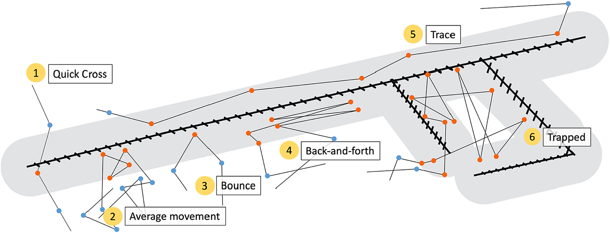
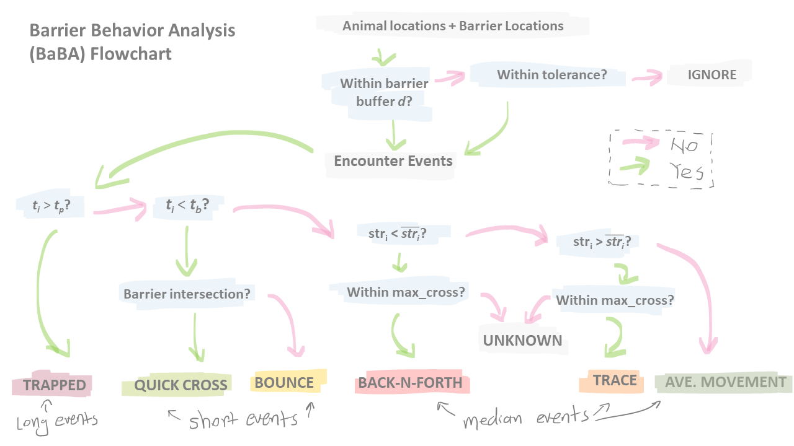
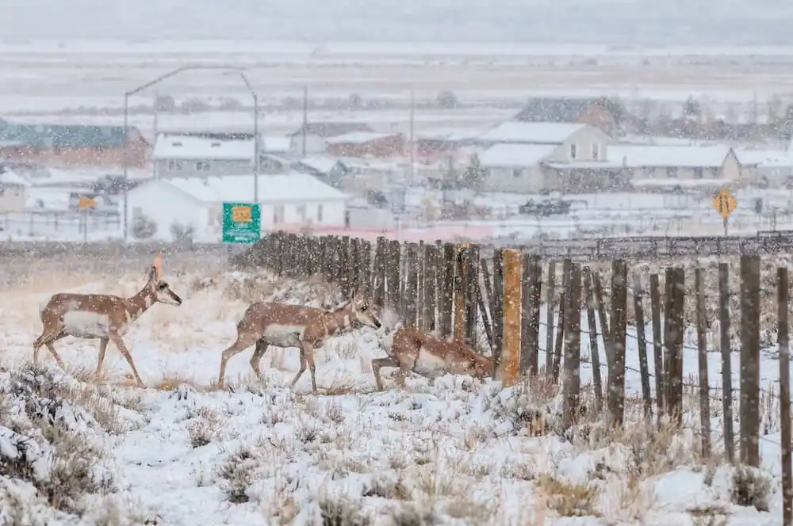
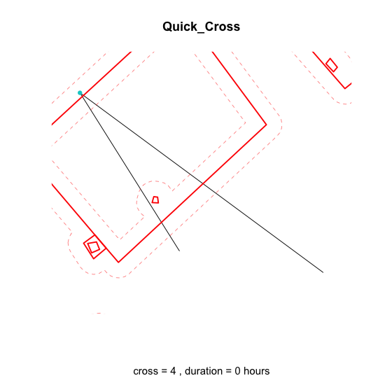
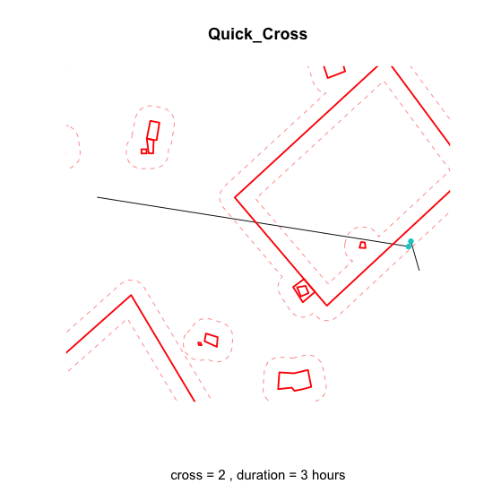

```{r setup, include=FALSE}
knitr::opts_chunk$set(echo = TRUE) # display both code and results 
knitr::opts_chunk$set(fig.pos = 'H')
```

--------------------------------------------------------

# Introduction
Linear infrastructure such as fences and roads can act as significant barriers to terrestrial animal movement. *Barrier behavior analysis (BaBA)* was developed to identify distinct behavioral responses that may be triggered by encounters with these linear features. By detecting such behaviors, the method enables conservation practitioners to prioritize segments of roads or fences that are particularly disruptive to animal movement. Built upon a set of fundamental movement metrics—including movement duration, step length, turning angle, and movement straightness—this approach demonstrates how combinations of simple descriptors can be used to infer more complex movement phenomena. In doing so, it offers a scalable tool for ecological inference and supports targeted conservation planning in fragmented landscapes.


In this exercise, we apply BaBA to animals in two kinds of fragmented landscapes - western US, where fences are mostly for defining grazing allotments, and they are long and connected; Kenya, where fences are mostly along roads and around human settlements, and they can be small and isolated. 

## Load Libraries and Data

`BaBA` is not hosted on CRAN and needs to be installed directly from GitHub: 
```{r install and load BaBA, eval = FALSE}
require("devtools")
devtools::install_github("wx-ecology/BaBA") 
```

Alternatively, you can install it locally (we downloaded the zip files for you): 
```{r install and load BaBA2, eval = FALSE}
require("devtools")
devtools::install_local("path/to/repository-folder") # they are under ./Package/
```

Load other libraries: 
```{r packages, warning=FALSE, message=FALSE, results='hide'}
# Remove from memory
rm(list=ls())

# load libearyß
library(BaBA)
library(sf)
library(mapview)
library(move2)
library(tidyverse) 
library(RColorBrewer)
library(gridExtra)
```

## Types of Barrier Behaviors 

<figure style="text-align: center;">

</figure>

Barrier behaviour categories classified by Barrier Behaviour Analysis. When a fence does not form a significant barrier to movement, animals may conduct *(1)* quick cross or *(2)* average movement. Otherwise, animal movement would be altered by the fence and the animal may conduct *(3)* bounce, *(4)* back-and-forth, *(5)* trace or get *(6)* trapped. The shade around fence lines represent the buffer area used to identify fence encounter events (orange dots) that will be subsequently classified into one of the barrier behaviours. Blue dots are the GPS fixes outside of the buffer.


## BaBA Workflow
The process of BaBA involves multiple decision and sorting steps, based on the parameters identified by users. The parameter assignment needs to be based on species ecology and expert understanding of the system. It also often involves picking a few example individuals and testing different parameter combos through output BaBA event images. We will walk throught the process via two examples: pronghorn in Wyoming, USA and wildebeest in Kenya. 

Detailed explanation of each parameter can be found through `?BaBA`.

<figure style="text-align: center;">

</figure>

## Pronghorn example 
Pronghorn is particularly susceptible to fences. They can run very fast over a vast plain, but they have not developed strong jumping capacity. Hence, they often crawl under fences rather than jumping over. If the fence is made from woven wire, it can be an impermeable barrier for the animal. 

<figure style="text-align: center;">

</figure>


```{r read pronghorn and fence data}
data("pronghorn")
data("fences")
```

Make sure animal and barrier data are under the same crs. BaBA requires data to be in projected coordinate system.
```{r data check}
st_crs(pronghorn) == st_crs(fences)
```


### visualize movement and fences 
Visualization is always the first step to understand the overall distribution and relative locations of your animals and the target barriers. 

This time we use `mapview` package, which is great for quick, interactive spatial data visualization for its simple syntax. 
```{r data visualization 1 }

pronghorn.lines <- pronghorn %>% 
  mt_as_move2(., time_column = "date", track_id_column = "Animal.ID") %>%
  mt_track_lines() 

# the first line will be plotted first, with later lines overlaid on top
mapView(fences, color = "grey", layer.name = "Fencelines") +
mapView(pronghorn.lines, zcol = "Animal.ID",layer.name = "Pronghorn lines", cex = 1) 
    
```


### examine parameters with output images 
Now we can run BaBA. We will start with default parameters. When choosing exporting images, it will take a few mins to run. We ran the code for you ahead of time and you can directly read the result: 
```{r run baba 1}

# results_prong <- BaBA(animal = pronghorn, 
#                       barrier = fences, 
#                       b_time = 4, p_time = 36, d = 110, max_cross = 4,
#                       export_images = T, 
#                       img_path = "./Output/BaBA_viz_pronghorn/", img_suffix = "pronghorn")

# you can read results here:
results_prong <- read_rds("./Output/BaBA_results_prong.rds")
```

Check out the BaBA event images in "./Output/BaBA_viz_pronghorn/". Do they look reasonable? 

The parameter setting here is based on multiple rounds of experiments and expert opinions. The goal is not to be perfect, but to gain most amount of ecological insights. 


### visualize barrier behaviors on map
The output files include an 'encounters' sf object with classified barrier behaviors, and an event table with classification details.

```{r view baba result 1 }
# View BaBA results

head(results_prong$classification)

# plot encounter event locations

  mapView(results_prong$encounters, zcol = "eventTYPE",
          col.regions = brewer.pal(n = 5, name = "Set1"), layer.name = "Pronghorn BaBA", cex = 4) +
    mapView(fences, color = "grey", layer.name = "Fencelines") 

```
|           <span style="color:tomato">**QUESTION 1: ** What information can you see from this map, and how could that be used to inform conservation decisions? </span>
<br/><br/>


## Wildebeest example 

```{r read WB data}
# read fence lines
fence.kenya <-  st_read("./Data/Fencelines2010_UTM37S.gpkg") 

# load data and filter out the unreliable locations
WB <- read_rds("./Data/wildebeest_3hr_adehabitat.rds") %>%
  as_tibble() %>% 
  rename(Animal.ID = animal_id) %>%
  mutate(Animal.ID = factor(Animal.ID)) %>% # BaBA requires the ID column to be named "Animal.ID" and timestamp column to be namaed "date"
  drop_na(x, y) %>%
  st_as_sf(., coords = c("x", "y"), crs = st_crs(32737))
head(WB)
```

Usually higher fix rate would be preferred for individual behavior analysis (think about how many things an ungulate can do in 2-3 hours!). Here we are using 3-hour wildebeest data. It is recommended to not go below this temporal resolution for BaBA for behavioral-level inference.  

Check coordinate system:
```{r data transform}
st_crs(WB) == st_crs(fence.kenya)

```

### visualize movement and fences
```{r data viz}

WB.lines <- WB %>% 
  mt_as_move2(., time_column = "date", track_id_column = "id") %>%
  mt_track_lines() 

mapView(WB.lines, zcol = "id",
          layer.name = "Wildebeest", cex = 1) +
    mapView(fence.kenya, color = "grey", layer.name = "Fencelines") 
```

As mentioned before, fences in Kenya are very different from the Wyoming fences. So the parameters need to be different to fit the ecological context. 


### identifying parameters
We will use one individual as an example to search for the best parameters combo. 

First run on one starting set of parameter to visualize it. The initial parameters are based on expert knowledge - how many hours of fence interaction would you call that it is normal v.s. altered behavior? What is a reasonable distance to identify these encounters? 

Since the code will take a while to run when `export_images = T`, we ran the code ahead of time and you can directly read the result: 

```{r filter to one ind}
WB.sf.1ind = WB %>% 
  filter(id == unique(id)[1])

# results_WB1 <- BaBA(animal = WB.sf.1ind,
#                       barrier = fence.kenya,
#                       d = 100,
#                       interval = 3, units = "hours",
#                       b_time = 3, p_time = 36, 
#                       export_images = T,
#                       img_path = "./Output/BaBA_viz_wb/b3_d100/", img_suffix = "wb_b3_d100")

# directly read results here
results_WB1 <- read_rds("./Output/BaBA_results_WB1.rds")
```

Now we can check the output images - the classified images look reasonable. However, because the fences are dense while the temporal resolution is 3 h, most of the "quick cross" is actually more like a "bounce" - it is unlikely that they actually "crossed" the fence, but more likely they moved around the fenced plots. This suggests that we may need a secondary re-classification after the automatic classification process. 

<div style="text-align: center;">

<div style="display: inline-block; width: 48%;">

<p style="text-align:center;"><em>Exanple quick cross1</em></p>
</div>

<div style="display: inline-block; width: 48%;">

<p style="text-align:center;"><em>Example quick cross2</em></p>
</div>

</div>

Now we can to test a series of buffer distances to see whether different barrier distances can lead to different ecological insights, and whether we can find an optimal distance that can best capture the barrier interactions.

```{r run baba 5}
# event = tibble()
# for (dist in seq(100,1000, by = 100)) {
# results_WB_dist <- BaBA(animal = WB.sf.1ind, 
#                       barrier = fence.kenya, 
#                       d = dist,
#                       interval = 3, units = "hours",
#                       b_time = 3, p_time = 36,  
#                       export_images = F)
# event.dist <- tibble(results_WB_dist$classification) %>% mutate(buffer_dist = dist)
# event <- rbind(event, event.dist)
# }


# directly read results here
event <- read_rds("./Output/BaBA_results_WB_dist.rds")

```

Make some graphs to visualize the classification changes across different buffer distances: 
```{r compare dist results}
event_summary <- event %>%
  group_by(buffer_dist, eventTYPE) %>%
  summarise(count = n(), .groups = "drop") %>%
  group_by(buffer_dist) %>%
  mutate(
    sum = sum(count),
    proportion = count / sum(count)) 

# stack bar plots to visualize total event counts and counts of different behaviors
p_all_type <- event_summary %>%
  ggplot(aes(x = factor(buffer_dist), y = sum, fill= eventTYPE)) +
  geom_bar(stat = "identity") +
  labs(x = "Buffer Distance (m)", y = "Event Count", fill = "Event Type") +
  theme_minimal()

# line plots for each behavior to visualize the change in their proportion in total events
p_all_type_line <- event_summary %>%
  ggplot(aes(x = factor(buffer_dist), y = proportion, group= eventTYPE, color = eventTYPE)) +
  geom_line() +
  scale_y_continuous(labels = scales::percent_format()) +
  labs(x = "Buffer Distance (m)", y = "Event Count", fill = "Event Type") +
  theme_minimal()
grid.arrange(p_all_type, p_all_type_line)
```

As buffer distance increase, more tracking locations would be included inside of the buffer. Hence, the number of "events", or consecutive tracking locations within the buffer, would eventually decrease. We can see that at 300 meters, the total barrier behavior detection peaked. If your goal is to capture most amount of barrier behaviors, around 300 would be a good distance to use as the buffer. 

Let's apply the parameters to the full dataset. 

```{r baba WB full set}
# results_WB_full <- BaBA(animal = WB,
#                       barrier = fence.kenya,
#                       d = 300,
#                       interval = 3, units = "hours",
#                       b_time = 3, p_time = 36,
#                       export_images = F)

results_WB_full <- read_rds("./Output/BaBA_results_WB_full.rds")
```
### visualize barrier behaviors on map
Finally, we can then visualize the barrier behaviors detected: 
```{r baba WB full set plotting}
# reclassify quick-cross as bounce (due to reasons discussed above)
results_WB_full$encounters <- results_WB_full$encounters %>% 
  mutate(eventTYPE = ifelse(eventTYPE == "Quick_Cross", "Bounce", eventTYPE))

# Define colors for event types
event_colors <- brewer.pal(n = 6, name = "Set1")

ggplot() +
  # Plot fencelines
  geom_sf(data = fence.kenya, color = "grey", size = 0.3) +
  # Plot encounter points, colored by event type
  geom_sf(data = results_WB_full$encounters, aes(color = eventTYPE), size = 2) +
  scale_color_manual(values = event_colors) +
  theme_minimal() +
  labs(title = "Wildebeest Barrier Behavior Events",
       color = "Event Type") +
  theme(legend.position = "right")
```

## A few thoughts

BaBA is an example of how basic movement metrics can be combined to gain deeper ecological insights. It is a flexible tool that can be adapted to address a variety of ecological questions.

For example, in Aikens et al (2025), we used BaBA mainly to derive barrier interaction time - but not the behavior types - to show that animals interact with barriers for longer time during a deadly snow storm. In Fullman et al (2025), they expanded the original utility of BaBA by adjusting the movement metrics used in the workflow to fit their specific ecological context (caribou-road interactions in the arctic where barriers are sparse, and animal tracking data is very coarse [8h on average].) 

Hope this inspires you to find and adapt your own movement-based tools to address your own ecological and conservation challenges.

---------------------
Further readings:

+ Xu W, Dejid N, Herrmann V, Sawyer H, Middleton AD. (2021). Barrier Behaviour Analysis (BaBA) reveals extensive effects of fencing on wide-ranging ungulates. Journal of Applied Ecology. 58(4), 690-698. https://doi.org/10.1111/1365-2664.13806

+ Aikens, E. O., Merkle, J. A., Xu, W., & Sawyer, H. (2025). Pronghorn movements and mortality during extreme weather highlight the critical importance of connectivity. Current Biology. https://doi.org/10.1016/j.cub.2025.03.010 

+ Fullman, T. J., Joly, K., Gustine, D. D., & Cameron, M. D. (2025). Behavioral responses of migratory caribou to semi-permeable roads in Arctic Alaska. Scientific Reports, 15(1), 24712. https://doi.org/10.1038/s41598-025-10216-6 

+ Stabach, Jared A., Lacey F. Hughey, Ramiro D. Crego, Christen H. Fleming, J. Grant C. Hopcraft, Peter Leimgruber, Thomas A. Morrison et al. "Increasing anthropogenic disturbance restricts wildebeest movement across East African grazing systems." Frontiers in Ecology and Evolution 10 (2022): 846171. https://doi.org/10.3389/fevo.2022.846171 


 <center> -----------------     (ﾉ◕ヮ◕)ﾉ*:･ﾟ✧  THE END :･ﾟ･ﾟ     ------------------ </center>