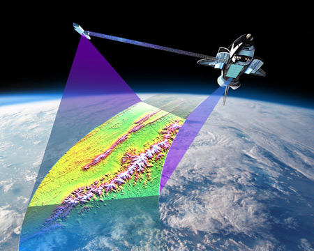

```{r setup, include=FALSE}
knitr::opts_chunk$set(echo = TRUE)
```

<a href="https://github.com/Animal-Movements/China_2025.git" class="github-corner" aria-label="View source on GitHub"><svg width="80" height="80" viewBox="0 0 250 250" style="fill:#151513; color:#fff; position: absolute; top: 0; border: 0; right: 0;" aria-hidden="true"><path d="M0,0 L115,115 L130,115 L142,142 L250,250 L250,0 Z"></path><path d="M128.3,109.0 C113.8,99.7 119.0,89.6 119.0,89.6 C122.0,82.7 120.5,78.6 120.5,78.6 C119.2,72.0 123.4,76.3 123.4,76.3 C127.3,80.9 125.5,87.3 125.5,87.3 C122.9,97.6 130.6,101.9 134.4,103.2" fill="currentColor" style="transform-origin: 130px 106px;" class="octo-arm"></path><path d="M115.0,115.0 C114.9,115.1 118.7,116.5 119.8,115.4 L133.7,101.6 C136.9,99.2 139.9,98.4 142.2,98.6 C133.8,88.0 127.5,74.4 143.8,58.0 C148.5,53.4 154.0,51.2 159.7,51.0 C160.3,49.4 163.2,43.6 171.4,40.1 C171.4,40.1 176.1,42.5 178.8,56.2 C183.1,58.6 187.2,61.8 190.9,65.4 C194.5,69.0 197.7,73.2 200.1,77.6 C213.8,80.2 216.3,84.9 216.3,84.9 C212.7,93.1 206.9,96.0 205.4,96.6 C205.1,102.4 203.0,107.8 198.3,112.5 C181.9,128.9 168.3,122.5 157.7,114.1 C157.9,116.9 156.7,120.9 152.7,124.9 L141.0,136.5 C139.8,137.7 141.6,141.9 141.8,141.8 Z" fill="currentColor" class="octo-body"></path></svg></a><style>.github-corner:hover .octo-arm{animation:octocat-wave 560ms ease-in-out}@keyframes octocat-wave{0%,100%{transform:rotate(0)}20%,60%{transform:rotate(-25deg)}40%,80%{transform:rotate(10deg)}}@media (max-width:500px){.github-corner:hover .octo-arm{animation:none}.github-corner .octo-arm{animation:octocat-wave 560ms ease-in-out}}</style>

# Introduction
In this example, we will load the Shuttle Radar Topography Mission (SRTM) data for our study area in Kenya to demonstrate how to extract remotely sensed data at our GPS point locations.  These data have been downloaded in 4 separate tiles and are provided in a geographic projection.  Together, we will load the raster files and mosaic the files together before extracing the elevation data at our spatial points.

<div style="float:right">

</div>

The SRTM payload flew aboard the Space Shuttle Endeavour during the STS-99 mission, collecting topography data over nearly 80% of Earth's land surface and creating the first-ever near-global dataset of land elevations. The Endeavour mission took place on February 11-22, 2000, with results that are provided in a Geographic projection at 1 and 3 arc-seconds (approximately 30 and 90 meters, respectively).

We will load the [sf](https://search.r-project.org/CRAN/refmans/sf/html/sf-package.html) features object that we created in the "1_DataCleaning" lecture.  Since these data have been projected to UTM Zone 37 South, we will need to reproject the data to the match the coordinate system of the SRTM data before extracting the elevation data at each data point. 

**Please Note:** It is usually best practice to reproject spatial points to match a raster's projection because interpolation methods will distort the grid cells and (potentially) change the values.  This will lead to changes in the data that we want to avoid. 

```{r Clean Libraries, message=FALSE, warning=FALSE}
# Remove from memory
rm(list=ls())

# You may need to install these packages first
#install.packages('terra', 'sf', 'mapview')

# Load required libraries
library(terra)
library(sf)
library(mapview)
```

## Data Import - Spatial Points
Load the [sf](https://search.r-project.org/CRAN/refmans/sf/html/sf-package.html) object created in the previous exercise. Note that the `WB.sf` object was saved after being projected to UTM Zone 37 South (`EPSG:32727`). We will need to reproject these data to decimal degrees (`EPSG:4326`) to extract the raster values at each point location.  

```{r Data Import, message=FALSE, warning=FALSE, echo=TRUE}
# Data load/import
load("Data/wildebeest_data.rdata")

# Check the Coordinate Reference system.  Should be 32737
#WB.sf

# Set Projection Information
LatLong.proj <- "EPSG:4326"
UtmZone.proj <- "EPSG:32737"

# Transform the dataset to dd
WB.sf.dd <- WB.sf %>% 
  st_transform(LatLong.proj)

# Check project
WB.sf.dd

# View your data in leaflet.  We'll use mapview to do this.
mapview(WB.sf.dd)
```

## Data Import - Raster Layers
Now that we have our spatial points loaded, we will load the SRTM data.  We'll use the `list.files()` function to load all files and then convert the ".hgt" files to a `raster_list()`.

```{r List Files, message=FALSE, warning=FALSE}
# List the files with the pattern hgt in the srtm folder
dir.srtm <- paste0(getwd(),"/Data/srtm/")
AllFiles <- list.files(path = dir.srtm, pattern = ".hgt", full.names = TRUE)

# Load all raster files as a list
raster_list <- lapply(AllFiles, rast)

# Images can be visualized using image
image(raster_list[[1]])

# Note the coordinate reference
raster_list[[1]]
```

# Create Raster Mosaic
Because our rasters are saved as a list, we will use the `do.call()` function to `merge())` the grids together.  If there were overlap between the rasters we were merging, we would need to use the `mosaic()` function.  See `help(mosaic)` for more information.

```{r Mosaic, message=FALSE, warning=FALSE, echo=TRUE, eval = TRUE}
# Mosaic the rasters together.
raster_srtm <- do.call(merge, raster_list)
# Or if overlap between the rasters exists
#raster_srtm <- do.call(mosaic, c(raster_list, fun = mean))


# Check to determine if the raster image and data points overlap
image(raster_srtm)
points(WB.sf.dd)
```

# Data Extraction
Now use the `extract()` function to append the SRTM data values to the spatial data points. 

```{r Extract, message=FALSE, warning=FALSE, echo=TRUE, eval = TRUE}
# Extract raster value at points
Vals <- extract(raster_srtm, WB.sf.dd)

# Append the data back to the WB.sf.dd object. Remove the first column from the result, keeping everything else.
WB.sf.dd$srtm <- Vals[,-1] 
# Done!  Easy!
```

# Exercise:
Raster data layers can become quite large and difficult to handle in memory.  In these cases, it's often better to process each raster in a stepwise fashion, rather than merging or mosaicking them together.  

How would you cycle through each raster, extracting the values from each, before moving on to the next raster in sequence?  Note, the difficult part with this exercise is determining how to append the extracted data in a single column to your dataframe. 

```{r Reproj Verify, message=FALSE, warning=FALSE, results='hide', echo=FALSE, eval = FALSE}
# Create a temporary matrix to hold the results
Temp.vals <- matrix(NA, nrow = nrow(WB.sf.dd), ncol = length(raster_list))

# Cycle through each raster and extract
for(i in 1:length(raster_list)){
  Vals <- extract(raster_list[[i]], WB.sf.dd)
  # Put the values in the Temp.vals matrix, organized by column
  Temp.vals[,i] <- Vals[,-1]
}

# Remove na values by summing across rows
srtm <- rowSums(Temp.vals, na.rm = TRUE)

# Combine back into the original dataframe
WB.sf.dd$srtm2 <- srtm
```