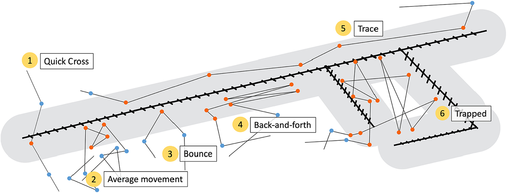
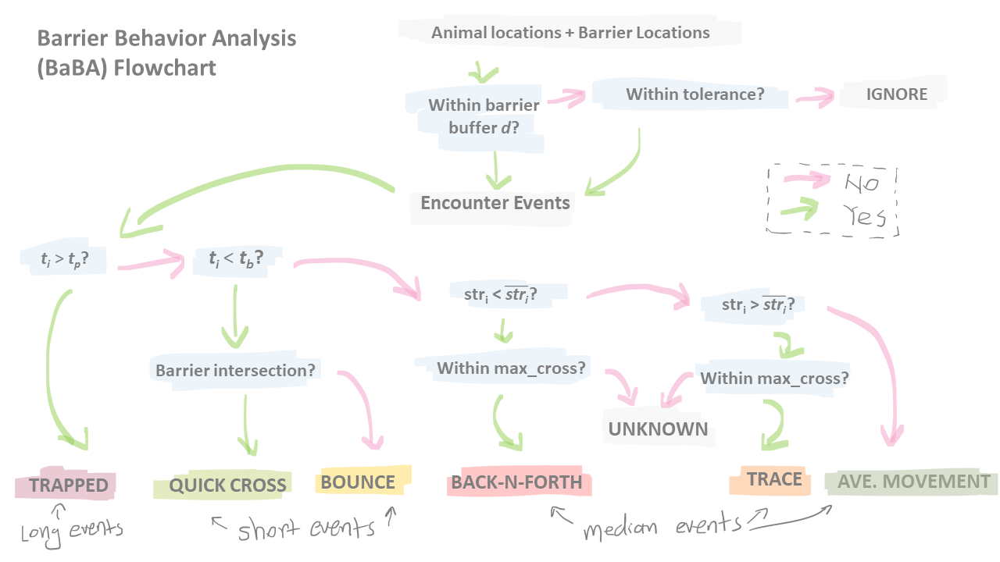
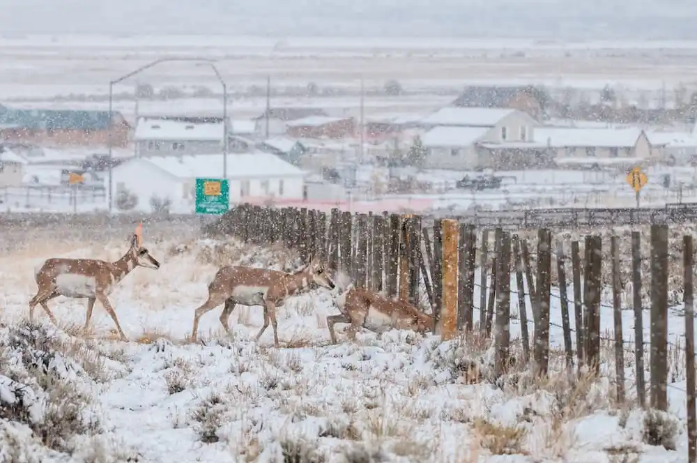
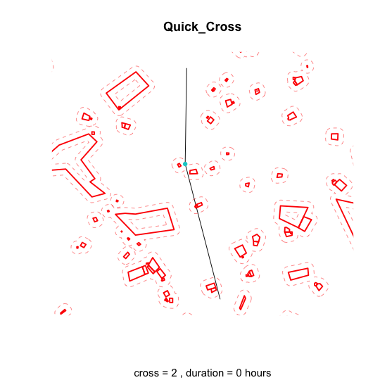
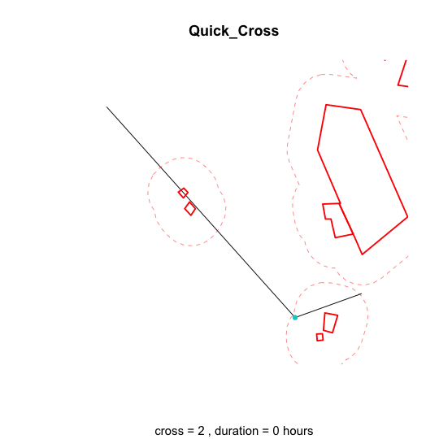
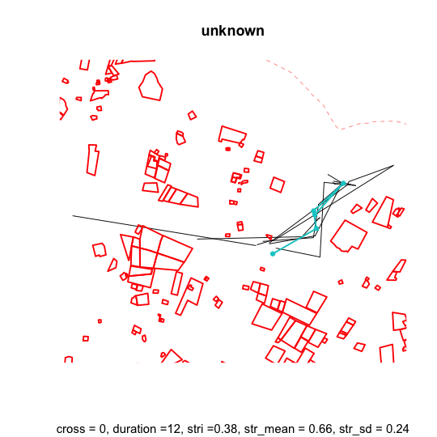
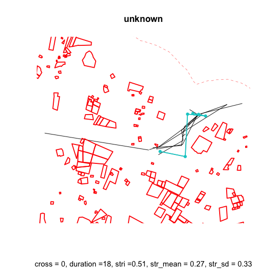

```{r setup, include=FALSE}
knitr::opts_chunk$set(echo = TRUE, message = FALSE, warning = FALSE)
```

<a href="https://github.com/Animal-Movements/China_2026.git" class="github-corner" aria-label="View source on GitHub"><svg width="80" height="80" viewBox="0 0 250 250" style="fill:#151513; color:#fff; position: absolute; top: 0; border: 0; right: 0;" aria-hidden="true"><path d="M0,0 L115,115 L130,115 L142,142 L250,250 L250,0 Z"></path><path d="M128.3,109.0 C113.8,99.7 119.0,89.6 119.0,89.6 C122.0,82.7 120.5,78.6 120.5,78.6 C119.2,72.0 123.4,76.3 123.4,76.3 C127.3,80.9 125.5,87.3 125.5,87.3 C122.9,97.6 130.6,101.9 134.4,103.2" fill="currentColor" style="transform-origin: 130px 106px;" class="octo-arm"></path><path d="M115.0,115.0 C114.9,115.1 118.7,116.5 119.8,115.4 L133.7,101.6 C136.9,99.2 139.9,98.4 142.2,98.6 C133.8,88.0 127.5,74.4 143.8,58.0 C148.5,53.4 154.0,51.2 159.7,51.0 C160.3,49.4 163.2,43.6 171.4,40.1 C171.4,40.1 176.1,42.5 178.8,56.2 C183.1,58.6 187.2,61.8 190.9,65.4 C194.5,69.0 197.7,73.2 200.1,77.6 C213.8,80.2 216.3,84.9 216.3,84.9 C212.7,93.1 206.9,96.0 205.4,96.6 C205.1,102.4 203.0,107.8 198.3,112.5 C181.9,128.9 168.3,122.5 157.7,114.1 C157.9,116.9 156.7,120.9 152.7,124.9 L141.0,136.5 C139.8,137.7 141.6,141.9 141.8,141.8 Z" fill="currentColor" class="octo-body"></path></svg></a><style>.github-corner:hover .octo-arm{animation:octocat-wave 560ms ease-in-out}@keyframes octocat-wave{0%,100%{transform:rotate(0)}20%,60%{transform:rotate(10deg)}40%,80%{transform:rotate(10deg)}}@media (max-width:500px){.github-corner:hover .octo-arm{animation:none}.github-corner .octo-arm{animation:octocat-wave 560ms ease-in-out}}</style>

---

## Learning Objectives

By the end of this module you will be able to:

1. Explain what Barrier Behaviour Analysis (BaBA) classifies, and why combining a few simple movement metrics (step length, turning angle, encounter duration) lets you infer a more complex behavioral response to a barrier
2. Run `BaBA()` on a set of animal tracks and a linear barrier layer, and interpret its six behavior classifications (quick cross, average movement, bounce, back-and-forth, trace, trapped)
3. Tune BaBA's key parameters — buffer distance (`d`) and encounter-duration thresholds (`b_time`, `p_time`) — against a known ecological context, and recognize when a parameter choice is producing an artifact rather than a real behavioral signal
4. Explain why the same method needs different parameter values across two structurally different fenced landscapes

**Packages used:** `BaBA`, `sf`, `mapview`, `move2`, `tidyverse`, `RColorBrewer`, `gridExtra`

---

## Ecological context: why study barrier behavior?

Linear infrastructure — fences, roads — can act as significant barriers to terrestrial animal movement. **Barrier Behaviour Analysis** (BaBA; Xu et al. 2021, *Journal of Applied Ecology* 58(4):690–698) was developed to identify distinct behavioral responses an animal exhibits when it encounters one of these features. It's built on exactly the kind of discrete movement metrics covered on Day 2 — step length, turning angle, and movement duration — and is a good illustration of how simple descriptors, combined and applied to a spatial context (here, proximity to a barrier), can be used to infer a more complex movement phenomenon. By detecting these behaviors at the level of individual encounter events rather than treating "there's a fence here" as a single yes/no barrier judgment, BaBA lets conservation practitioners prioritize which specific fence or road segments are most disruptive to movement.

This module applies BaBA to two structurally different fragmented landscapes. In Wyoming, USA, pronghorn (*Antilocapra americana*) encounter fences that mark grazing allotments — typically long, continuous, and built to a standard woven-wire spec that pronghorn (fast runners but poor jumpers) often cannot cross. In Kenya, the Athi-Kaputiei wildebeest — the same population used throughout this workshop — encounter fences that cluster around roads and human settlements: shorter, denser, and more discontinuous, reflecting Nairobi's expanding peri-urban edge (Stabach et al. 2022, *Frontiers in Ecology and Evolution* 10:846171). The same method, applied to two genuinely different fence structures, needs genuinely different parameter choices — that contrast is the main methodological lesson of this module, alongside the behavior classifications themselves.

---

## 1. Setup

### 1.1 Install and load BaBA

`BaBA` is not on CRAN and needs to be installed from GitHub:

```{r install_baba_github, eval = FALSE}
require("devtools")
devtools::install_github("wx-ecology/BaBA")
```

Alternatively, install it from the zip bundled with this module (`Package/BaBA-master.zip`) if GitHub access is unreliable:

```{r install_baba_local, eval = FALSE}
require("devtools")
devtools::install_local("Package/BaBA-master.zip")
```

### 1.2 Load packages

```{r packages}
library(BaBA)         # Barrier Behaviour Analysis
library(sf)            # Spatial vector data
library(mapview)       # Quick interactive maps
library(move2)          # move2 object conversion/utilities
library(tidyverse)     # Data wrangling and visualization
library(RColorBrewer)  # Color palettes for behavior-type plots
library(gridExtra)     # Arranging multiple ggplot panels
```

---

## 2. What BaBA classifies

<figure style="text-align: center;">

</figure>

When a fence does not form a significant barrier to movement, animals may show *(1)* quick cross or *(2)* average movement. Otherwise, movement is altered by the fence and the animal may show *(3)* bounce, *(4)* back-and-forth, *(5)* trace, or get *(6)* trapped. The shaded band around the fence line marks the buffer used to flag fence-encounter fixes (orange dots), which are then classified into one of these six behaviors; blue dots are fixes outside the buffer.

BaBA's workflow involves several decision and sorting steps, driven by parameters the user sets based on species ecology and expert knowledge of the system:

<figure style="text-align: center;">

</figure>

Choosing those parameters usually means picking a few example individuals and testing different parameter combinations against the exported event images BaBA produces — exactly the workflow Sections 3–4 below walk through, for two species and fence structures with very different ecology. Full parameter definitions are available via `?BaBA`.

---

## 3. Pronghorn example (Wyoming)

Pronghorn are particularly susceptible to fences. They can outrun most predators on the open plain but have not evolved a strong jumping capacity, so they typically crawl under a fence rather than jump over it — which means a woven-wire fence, easy for most other ungulates to clear, can be effectively impermeable to them.

<figure style="text-align: center;">

</figure>

### 3.1 Load data

The `BaBA` package ships with an example pronghorn/fence dataset, so no external file is needed here:

```{r load_pronghorn}
data("pronghorn")
data("fences")
```

BaBA requires the animal and barrier data to share a projected coordinate reference system:

```{r pronghorn_crs_check}
st_crs(pronghorn) == st_crs(fences)
```

### 3.2 Visualize movement and fences

Visualization is always the first step — get a feel for the overall distribution of animals relative to the barriers before running anything. `mapview` is convenient here for quick, interactive spatial visualization:

```{r pronghorn_viz}
pronghorn.lines <- pronghorn %>%
  mt_as_move2(., time_column = "date", track_id_column = "Animal.ID") %>%
  mt_track_lines()

# the first layer is plotted first, with later layers drawn on top
mapView(fences, color = "grey", layer.name = "Fencelines") +
  mapView(pronghorn.lines, zcol = "Animal.ID", layer.name = "Pronghorn lines", cex = 1)
```

### 3.3 Run BaBA with default parameters

Exporting event images takes a few minutes to run, so the result is pre-computed — load it directly:

```{r pronghorn_run_baba, eval = FALSE}
results_prong <- BaBA(animal = pronghorn,
                       barrier = fences,
                       b_time = 4, p_time = 36, d = 110, max_cross = 4,
                       export_images = TRUE,
                       img_path = "./Output/BaBA_viz_pronghorn/", img_suffix = "pronghorn")
```

```{r pronghorn_load_baba}
results_prong <- read_rds("./Output/BaBA_results_prong.rds")
```

Browse the exported event images in `Output/BaBA_viz_pronghorn/` — do the classifications look ecologically reasonable for each behavior type? The parameter values above reflect several rounds of testing against exactly this kind of visual check, combined with expert judgment about pronghorn fence-crossing behavior. The goal of parameter tuning is never a "perfect" fit, but the most ecological insight from a method that's ultimately a heuristic classifier.

### 3.4 Visualize classified behaviors on the map

The BaBA output includes an `encounters` `sf` object with classified behaviors, plus a `classification` event table with the underlying details:

```{r pronghorn_view_results}
head(results_prong$classification)

mapView(results_prong$encounters, zcol = "eventTYPE",
        col.regions = brewer.pal(n = 5, name = "Set1"), layer.name = "Pronghorn BaBA", cex = 4) +
  mapView(fences, color = "grey", layer.name = "Fencelines")
```

> **Discussion:** What information can you read off this map that a simple "barrier present / absent" classification couldn't give you? Look at where each behavior type clusters along the fence line rather than just at the overall mix of behaviors — how might that spatial pattern translate into a concrete conservation recommendation (e.g., where to prioritize a wildlife-friendly fence retrofit)?

---

## 4. Wildebeest example (Kenya): tuning parameters

### 4.1 Load data

```{r load_wb}
# read fence lines
fence.kenya <- st_read("./Data/Fencelines2010_UTM37S.gpkg")

# load data and drop unreliable (missing-coordinate) locations
WB <- read_rds("./Data/wildebeest_3hr_adehabitat.rds") %>%
  as_tibble() %>%
  rename(Animal.ID = animal_id) %>%
  mutate(Animal.ID = factor(Animal.ID)) %>%   # BaBA requires an "Animal.ID" column and a "date" timestamp column
  drop_na(x, y) %>%
  st_as_sf(., coords = c("x", "y"), crs = st_crs(32737))

head(WB)
```

This wildebeest dataset is fixed at a 3-hour interval. Higher fix rates are generally preferable for individual-level behavior analysis — a lot can happen to a moving ungulate in 2–3 hours — and going coarser than this is not recommended for BaBA's behavioral-level inference.

```{r wb_crs_check}
st_crs(WB) == st_crs(fence.kenya)
```

### 4.2 Visualize movement and fences

```{r wb_viz}
WB.lines <- WB %>%
  mt_as_move2(., time_column = "date", track_id_column = "id") %>%
  mt_track_lines()

mapView(WB.lines, zcol = "id", layer.name = "Wildebeest", cex = 1) +
  mapView(fence.kenya, color = "grey", layer.name = "Fencelines")
```

As the Ecological Context section noted, Kenyan fences look very different from the Wyoming fences above — so the parameters need to change to fit this ecological context, not just the species.

### 4.3 Testing buffer distance on two individuals

We'll use two individuals — Ntishya and Sotua, chosen because they have relatively large, separated ranges and so are reasonably representative of the population — to search for a workable buffer distance (`d`).

Because the fix interval is 3 hours, the shortest interaction BaBA can resolve is also 3 hours, so `b_time` is set to that minimum. Because the fences are dense, many fence "crossings" identified just by intersecting the track with the fence line won't reflect a real-world crossing — some secondary reclassification may be needed later. That leaves buffer distance as the key parameter to tune here: at what distance from a fence do we recognize a fix as a barrier interaction at all? We'll test two extremes.

Exporting images takes a while, so the results are pre-computed:

```{r wb_2ind_run, eval = FALSE}
# pick two individuals with relatively large, separated ranges
WB.sf.2ind <- WB %>%
  filter(id %in% c("Ntishya", "Sotua")) %>%
  arrange(id, date)

results_WB1 <- BaBA(animal = WB.sf.2ind,
                     barrier = fence.kenya,
                     d = 100,
                     interval = 3, units = "hours",
                     b_time = 3, p_time = 36,
                     max_cross = 10,   # set high since most intersections aren't real crossings, given fence density and 3h resolution
                     export_images = TRUE,
                     img_path = "./Output/BaBA_viz_wb/b3_d100/", img_suffix = "wb_b3_d100")

results_WB2 <- BaBA(animal = WB.sf.2ind,
                     barrier = fence.kenya,
                     d = 1000,
                     interval = 3, units = "hours",
                     b_time = 3, p_time = 36,
                     max_cross = 10,
                     export_images = TRUE,
                     img_path = "./Output/BaBA_viz_wb/b3_d1000/", img_suffix = "wb_b3_d1000")
```

```{r wb_2ind_load}
WB.sf.2ind <- WB %>%
  filter(id %in% c("Ntishya", "Sotua")) %>%
  arrange(id, date)

results_WB1 <- read_rds("./Output/BaBA_2ind_WB1.rds")
results_WB2 <- read_rds("./Output/BaBA_2ind_WB2.rds")
```

At `d = 100`, short interactions (bounce, quick cross) are better resolved. But because the fences are dense relative to the 3-hour fix interval, most "quick cross" events here are more likely the animal moving around a fenced plot than actually crossing it — a hint that a secondary reclassification step will be needed after automatic classification.

<div style="text-align: center;">
<div style="display: inline-block; width: 48%;">

<p style="text-align:center;"><em>Example quick-cross event 1</em></p>
</div>
<div style="display: inline-block; width: 48%;">

<p style="text-align:center;"><em>Example quick-cross event 2</em></p>
</div>
</div>

At `d = 1000`, most captured events are longer (average movement, trapped). There are also several `unknown` events that look like one real encounter split into multiple separate bursts:

<div style="text-align: center;">
<div style="display: inline-block; width: 48%;">

<p style="text-align:center;"><em>Example split-encounter event 1</em></p>
</div>
<div style="display: inline-block; width: 48%;">

<p style="text-align:center;"><em>Example split-encounter event 2</em></p>
</div>
</div>

> **Note:** That split-encounter issue has a direct fix — BaBA's `tolerance` parameter merges two encounter bursts into one event if the gap between them is within `tolerance` fixes. Section 4.5 below uses it.

### 4.4 Comparing a range of buffer distances

With a feel for both extremes, we can now ask the question more systematically: does varying the buffer distance change the ecological insight we'd draw, and is there a distance that captures the most behavioral variation?

```{r wb_dist_sweep, eval = FALSE}
event <- tibble()
for (dist in seq(100, 1000, by = 100)) {
  results_WB_2ind_dist <- BaBA(animal = WB.sf.2ind,
                                barrier = fence.kenya,
                                d = dist,
                                interval = 3, units = "hours",
                                b_time = 3, p_time = 36,
                                max_cross = 10,
                                tolerance = 1,   # merge split bursts, per the Section 4.3 note
                                export_images = FALSE)

  event.dist <- tibble(results_WB_2ind_dist$classification) %>% mutate(buffer_dist = dist)
  event <- rbind(event, event.dist)
}
```

```{r wb_dist_sweep_load}
event <- read_rds("./Output/BaBA_2ind_WB_dist.rds")
```

```{r wb_dist_sweep_plot}
event_summary <- event %>%
  group_by(buffer_dist, eventTYPE) %>%
  summarise(count = n(), .groups = "drop") %>%
  group_by(buffer_dist) %>%
  mutate(sum = sum(count),
         proportion = count / sum(count))

# stacked bars: total event counts and the mix of behavior types
p_all_type <- event_summary %>%
  ggplot(aes(x = factor(buffer_dist), y = count, fill = eventTYPE)) +
  geom_bar(stat = "identity") +
  labs(x = "Buffer distance (m)", y = "Event count", fill = "Event type") +
  theme_minimal()

# lines: how each behavior's share of total events shifts with buffer distance
p_all_type_line <- event_summary %>%
  ggplot(aes(x = factor(buffer_dist), y = proportion, group = eventTYPE, color = eventTYPE)) +
  geom_line() +
  scale_y_continuous(labels = scales::percent_format()) +
  labs(x = "Buffer distance (m)", y = "Proportion of events", color = "Event type") +
  theme_minimal()

grid.arrange(p_all_type, p_all_type_line)
```

> **Discussion:** As buffer distance grows, more fixes fall inside the buffer, so consecutive in-buffer fixes increasingly merge into fewer, longer "events" — total event count should fall accordingly. Where does that decline level off, and where do you still see a good separation between short behaviors (bounce, quick cross) and long ones (average movement, trapped)? If your goal is to capture the most behavioral variation, that's the distance to use — here, that's roughly 300 m.

### 4.5 Applying tuned parameters to the full dataset

```{r wb_full_run, eval = FALSE}
results_WB_full <- BaBA(animal = WB,
                         barrier = fence.kenya,
                         d = 300,
                         interval = 3, units = "hours",
                         b_time = 3, p_time = 36,
                         export_images = FALSE)
```

```{r wb_full_load}
results_WB_full <- read_rds("./Output/BaBA_results_WB_full.rds")
```

### 4.6 Visualizing the final classification

```{r wb_full_plot}
# reclassify quick-cross as bounce, per the Section 4.3 finding that most of these
# aren't real crossings at this fence density and fix interval
results_WB_full$encounters <- results_WB_full$encounters %>%
  mutate(eventTYPE = ifelse(eventTYPE == "Quick_Cross", "Bounce", eventTYPE))

event_colors <- brewer.pal(n = 6, name = "Set1")

ggplot() +
  geom_sf(data = fence.kenya, color = "grey", linewidth = 0.3) +
  geom_sf(data = results_WB_full$encounters, aes(color = eventTYPE), size = 2) +
  scale_color_manual(values = event_colors) +
  theme_minimal() +
  labs(title = "Wildebeest barrier-behavior events", color = "Event type") +
  theme(legend.position = "right")
```

> **Discussion:** Notice the reclassification step right before this plot — "quick cross" became "bounce" based on what Section 4.3's example images showed, not based on anything BaBA's automatic output alone could tell you. This is the secondary reclassification flagged earlier: BaBA's classification is a strong starting point, not a final answer, and checking its output against example images for your own system is an essential step, not an optional one.

---

## 5. Beyond this module

BaBA is one example of how a few basic movement metrics, combined and applied relative to a spatial feature, can answer a question none of those metrics could answer alone. It's also flexible enough to be adapted well beyond its original use case:

- Aikens et al. (2025) used BaBA mainly to derive total barrier-interaction time — not the specific behavior types — to show that animals interacted with fences for longer during a deadly snowstorm.
- Fullman et al. (2025) adapted BaBA's underlying movement metrics to fit caribou–road interactions in the Arctic, where barriers are sparse and tracking data is much coarser (8-hour average fix interval) than the wildebeest data used here.

Both are useful templates for adapting BaBA — or its underlying logic — to a system that doesn't look like either of today's two examples.

**Further reading:**

- Xu W, Dejid N, Herrmann V, Sawyer H, Middleton AD. (2021). Barrier Behaviour Analysis (BaBA) reveals extensive effects of fencing on wide-ranging ungulates. *Journal of Applied Ecology*, 58(4), 690–698. https://doi.org/10.1111/1365-2664.13806
- Aikens, E. O., Merkle, J. A., Xu, W., & Sawyer, H. (2025). Pronghorn movements and mortality during extreme weather highlight the critical importance of connectivity. *Current Biology*. https://doi.org/10.1016/j.cub.2025.03.010
- Fullman, T. J., Joly, K., Gustine, D. D., & Cameron, M. D. (2025). Behavioral responses of migratory caribou to semi-permeable roads in Arctic Alaska. *Scientific Reports*, 15(1), 24712. https://doi.org/10.1038/s41598-025-10216-6
- Stabach, J. A., Hughey, L. F., Crego, R. D., Fleming, C. H., Hopcraft, J. G. C., Leimgruber, P., Morrison, T. A., et al. (2022). Increasing anthropogenic disturbance restricts wildebeest movement across East African grazing systems. *Frontiers in Ecology and Evolution*, 10, 846171. https://doi.org/10.3389/fevo.2022.846171

---

## Practice: Apply to your own data (if relevant to your work)

1. **Run `BaBA()`** on 1–2 individuals from your own dataset against a barrier layer relevant to your system (a fence, road, or other linear feature), starting from default-ish parameters informed by your species' ecology.
2. **Browse the exported event images** the way Sections 3.3 and 4.3 do here. Do the classifications look behaviorally reasonable, or does a parameter clearly need adjusting?
3. **Test at least two buffer distances** (Section 4.3–4.4's approach) and look at how the behavior-type mix shifts. Is there a distance where the classification stabilizes, the way it did around 300 m here?
4. **Apply your tuned parameters to the full dataset** and map the results (Section 4.6), checking whether any classifications need the kind of secondary reclassification step used here.

**Useful questions to answer for your own dataset:**

- Does your system's barrier structure look more like Wyoming's (long, continuous fences) or Kenya's (short, discontinuous fences near roads/settlements)? That alone should shape your starting parameter guesses.
- Is your fix interval fine enough to resolve the behavior you're trying to detect? BaBA's original validation used 3-hour-or-finer data; substantially coarser data (e.g., Fullman et al. 2025's 8-hour caribou example) requires rethinking what counts as a "short" vs. "long" encounter.
- Would a secondary reclassification step — merging adjacent short events, or relabeling ambiguous classifications — improve on BaBA's automatic output for your system, the way relabeling "quick cross" as "bounce" did here?
- Is a specific behavior type, or total barrier-interaction time regardless of type (as in Aikens et al. 2025), the more useful summary for your research question?

---

## Key functions reference

| Function | Package | Purpose |
|---|---|---|
| `BaBA()` | `BaBA` | Classify GPS fixes near a barrier into one of six behavioral responses, given buffer distance and timing parameters |
| `mt_as_move2()` | `move2` | Convert a non-`move2` object (e.g. a generic `sf` points object) into a `move2` object, given ID and timestamp columns |
| `mt_track_lines()` | `move2` | Collapse each individual's fixes into a `LINESTRING` for mapping |
| `mapView()` | `mapview` | Quick, interactive map of one or more spatial layers |
| `st_crs()` | `sf` | Check or retrieve a spatial object's coordinate reference system |
| `st_read()` | `sf` | Read a spatial vector file (e.g. a fence-line `.gpkg`) |

---

*Next: **Module 2 — Migration vs. range residence vs. disperser** — having classified discrete behavioral responses to a specific barrier, we move to classifying broader movement strategies across an individual's full track.*
