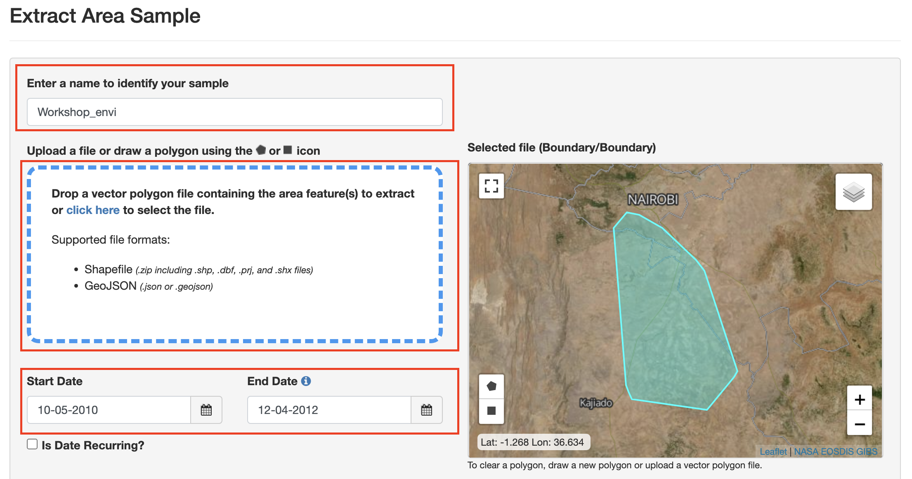
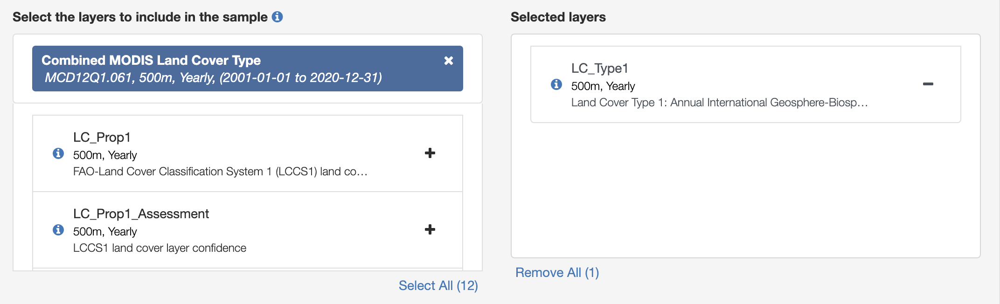
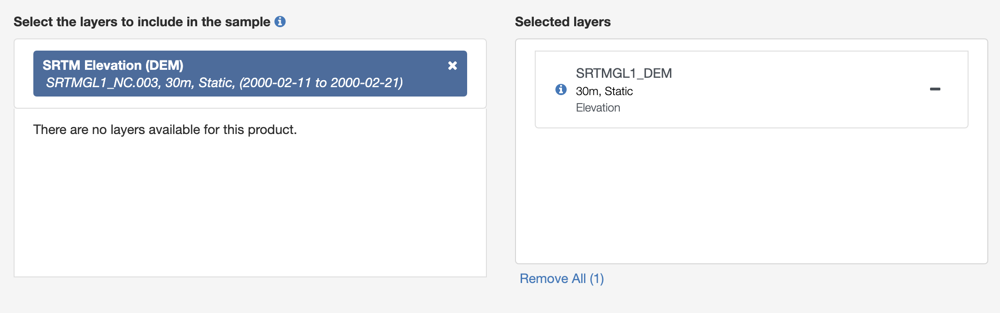
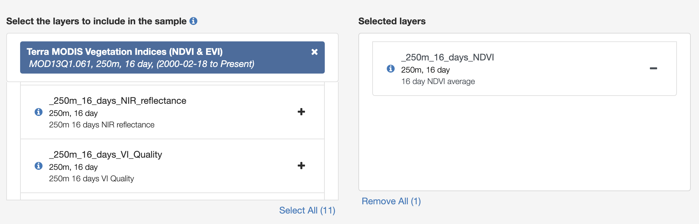
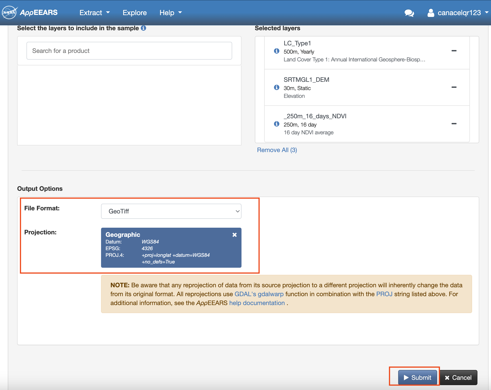
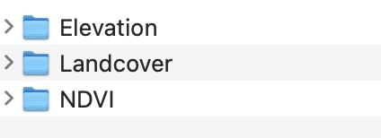

```{r setup, include=FALSE}
knitr::opts_chunk$set(echo = TRUE, message = FALSE, warning = FALSE)
```

<a href="https://github.com/Animal-Movements/China_2026.git" class="github-corner" aria-label="View source on GitHub"><svg width="80" height="80" viewBox="0 0 250 250" style="fill:#151513; color:#fff; position: absolute; top: 0; border: 0; right: 0;" aria-hidden="true"><path d="M0,0 L115,115 L130,115 L142,142 L250,250 L250,0 Z"></path><path d="M128.3,109.0 C113.8,99.7 119.0,89.6 119.0,89.6 C122.0,82.7 120.5,78.6 120.5,78.6 C119.2,72.0 123.4,76.3 123.4,76.3 C127.3,80.9 125.5,87.3 125.5,87.3 C122.9,97.6 130.6,101.9 134.4,103.2" fill="currentColor" style="transform-origin: 130px 106px;" class="octo-arm"></path><path d="M115.0,115.0 C114.9,115.1 118.7,116.5 119.8,115.4 L133.7,101.6 C136.9,99.2 139.9,98.4 142.2,98.6 C133.8,88.0 127.5,74.4 143.8,58.0 C148.5,53.4 154.0,51.2 159.7,51.0 C160.3,49.4 163.2,43.6 171.4,40.1 C171.4,40.1 176.1,42.5 178.8,56.2 C183.1,58.6 187.2,61.8 190.9,65.4 C194.5,69.0 197.7,73.2 200.1,77.6 C213.8,80.2 216.3,84.9 216.3,84.9 C212.7,93.1 206.9,96.0 205.4,96.6 C205.1,102.4 203.0,107.8 198.3,112.5 C181.9,128.9 168.3,122.5 157.7,114.1 C157.9,116.9 156.7,120.9 152.7,124.9 L141.0,136.5 C139.8,137.7 141.6,141.9 141.8,141.8 Z" fill="currentColor" class="octo-body"></path></svg></a><style>.github-corner:hover .octo-arm{animation:octocat-wave 560ms ease-in-out}@keyframes octocat-wave{0%,100%{transform:rotate(0)}20%,60%{transform:rotate(10deg)}40%,80%{transform:rotate(10deg)}}@media (max-width:500px){.github-corner:hover .octo-arm{animation:none}.github-corner .octo-arm{animation:octocat-wave 560ms ease-in-out}}</style>

---

## Learning Objectives

By the end of this module you will be able to:

1. Compare three routes for annotating GPS locations with environmental data — pre-downloaded raster + local extraction (`terra`), Movebank's server-side Env-DATA annotation service, and cloud-based extraction via Google Earth Engine (`rgee`) — and judge which fits a given project's scale, budget, and connectivity constraints.
3. Extract elevation, land cover, and a time-matched NDVI value onto GPS locations using `terra`, including mosaicking adjoining raster tiles and matching a 16-day composite product to each fix's nearest available date.
4. Visualize an annotated movement dataset to see how a landscape variable varies across a track.

**Packages used:** `terra`, `sf`, `tidyverse`, `lubridate`, `mapview`, `rgee` (Route 3 only — demonstration, not required to run)

---

## Ecological context: why annotate locations with environmental data?

A GPS fix tells you *where* an animal was and *when*. It does not, by itself, tell you *why* it was there. Almost every question that goes beyond describing movement — habitat selection, migration triggers, forage tracking, disturbance avoidance — requires joining each location (or each available "background" location) to the environmental conditions at that place and time. For a partially migratory, fence-constrained population like the Athi-Kaputiei wildebeest, whether an individual is standing in grassland or scrubland, at what elevation, and how green the vegetation was that week are exactly the variables that later distinguish a resource-tracking movement from a fence-forced detour. This module builds the annotated dataset that the following resource- and step-selection-function module will consume directly — annotation is a prerequisite for habitat selection, not a separate topic.

NDVI in particular has been used for decades as a remotely-sensed proxy for forage quantity/quality in exactly this kind of open rangeland system (Pettorelli et al. 2005, *Trends in Ecology & Evolution* 20(9):503–510), and land cover and terrain jointly describe the physical template — vegetation type and topography — that constrains where movement is even possible.

There is no single "correct" way to get environmental data onto a track. This module walks through three routes, in increasing order of how much of the work happens on your own machine versus a remote server:

- **Route 1 — download a raster, extract locally.** You obtain a GeoTIFF (e.g. from NASA's AppEEARS platform) and extract values at your points yourself, using `terra`. Full control over every step; you own a local copy of the data; but you manage reprojection, mosaicking, and file management.
- **Route 2 — submit your track, get back an annotated file.** Movebank's **Env-DATA Track Annotation Service** (Dodge et al. 2013, *Movement Ecology* 1:3) does the raster handling *for* you — you upload your tracks, pick from hundreds of pre-catalogued environmental products, and Movebank emails you back a CSV with the values already joined on. No raster files ever touch your computer.
- **Route 3 — query the raster archive live, in code.** Google Earth Engine, accessed from R via `rgee`, lets you query petabyte-scale environmental data catalogs programmatically without downloading anything — you write the extraction as code rather than clicking through a web form. Powerful, but requires reliable Earth Engine access (and please find instruction elsewhere about how to access GEE from mainland China).

---

## 1. Setup

### 1.1 Load packages

```{r packages}
# install.packages(c("terra", "sf", "tidyverse", "lubridate", "mapview"))
# rgee is only needed for Section 4 (Route 3) - see that section for install/auth notes

library(terra)      # Raster read, mosaic, terrain, extract
library(sf)         # Vector points/polygons
library(tidyverse)  # Data wrangling and plotting
library(lubridate)  # Date matching for NDVI composites
library(mapview)    # Quick interactive maps
```

### 1.2 Rebuild the point data

As before, we rebuild from the cleaned `move2` object rather than depending on anything saved from a previous module.

```{r load_data}
load("Data/WB_clean.rdata")   # loads WB.mv2, the cleaned wildebeest track data

WB_sf <- st_as_sf(as.data.frame(WB.mv2))
st_crs(WB_sf)$epsg   # 4326 - Movebank's native geographic CRS
```

> **Note:** Every raster layer we use below (SRTM elevation, MODIS land cover, MODIS NDVI) is also delivered in geographic WGS84. That means we can extract directly, in the native CRS, with no reprojection step — unlike the projected-CRS workflow used for home-range or step-metric work in earlier modules, where a metric (UTM) CRS was essential. Always check: extraction just needs *matching* CRSs, not necessarily a projected one.

For the worked examples below we'll focus on a single individual, **Sotua**, and extract to the full population only for the closing visualization.

```{r sotua_subset}
sotua_sf <- WB_sf %>% filter(individual_local_identifier == "Sotua")
nrow(sotua_sf)
```

### 1.3 Define the area of interest

Whether you're requesting data from AppEEARS or Movebank's Env-DATA, both ask you to define a geographic bounding area up front. Here we build a minimum convex polygon (MCP) around all tracked locations — this is the polygon you would export as a shapefile and upload to AppEEARS, or draw/select when submitting an Env-DATA request.

```{r mcp}
WB_mcp <- WB_sf %>% st_union() %>% st_convex_hull()

mapview(WB_mcp, alpha.regions = 0.1, layer.name = "Area of interest (MCP)") +
  mapview(sotua_sf, cex = 2, layer.name = "Sotua fixes")
```

---

## 2. Route 1: Pre-downloaded rasters + local extraction (`terra`)

### 2.1 Where these rasters came from: NASA AppEEARS

The elevation, land cover, and NDVI layers used in this section were downloaded ahead of time from NASA's [AppEEARS](https://appeears.earthdatacloud.nasa.gov/) platform (Application for Extracting and Exploring Analysis Ready Samples), so that class time goes to the R side rather than waiting on a data request. In your own work, the request looks like this:

#### Step 1

Navigate to the AppEEARS website, click **Extract** in the top left corner, and select **Area**. On the next page, choose **Start a new request**.


--------------------------------------------------------

#### Step 2

Set a name for your project, and upload a zipped shapefile of your area of interest — the MCP built in Section 1.3 above is exactly that polygon (`st_write(WB_mcp_wgs84, "Boundary.shp")` plus its `.dbf`/`.prj`/`.shx` siblings, zipped together). Set the start and end date to your study period.



--------------------------------------------------------

#### Step 3

Select the layers you need. This module uses three:

1. **Land cover type** — `MCD12Q1.061`, "Combined MODIS Land Cover Type" — "LC_Type1"
2. **Elevation** — `SRTMGL1_NC.003`, "SRTM Elevation (DEM)" — "SRTMGL1_DEM"
3. **NDVI** — `MOD13Q1.061`, "Terra MODIS Vegetation Indices (NDVI & EVI)" — "_250m_16_days_NDVI"







--------------------------------------------------------

#### Step 4

Choose the output format and projection: **GeoTIFF** format, **Geographic** (WGS84) projection. Then submit.



--------------------------------------------------------

#### Step 5

AppEEARS emails you a download link once the request finishes processing (usually minutes to a couple of hours — this is the step we've skipped by pre-downloading into `Data/`). Organize the download into per-layer folders, as done here (`Data/Landcover/`, `Data/srtm/`, `Data/NDVI/`).



--------------------------------------------------------

> **Practical note:** AppEEARS processing time is the reason this isn't run live in class — treat the AppEEARS steps above as something to try on your own data outside the session.

### 2.2 Elevation: mosaicking SRTM tiles

SRTM (Shuttle Radar Topography Mission) elevation ships as 1°×1° tiles named by their southwest corner. The Athi-Kaputiei Plains straddle four such tiles, already sitting in `Data/srtm/`.

```{r srtm_list}
srtm_files <- list.files("Data/srtm", pattern = "\\.hgt$", full.names = TRUE)
srtm_files
```

```{r srtm_mosaic}
srtm_tiles <- lapply(srtm_files, rast)

# merge() mosaics adjoining, non-overlapping tiles into one continuous raster.
# (If tiles overlapped, terra::mosaic() with a reducer function like mean would be the right tool instead.)
elev <- do.call(merge, srtm_tiles)
names(elev) <- "elevation_m"

plot(elev, main = "SRTM elevation (m) — Athi-Kaputiei Plains")
```

Extracting a raster value at a set of points is a single `terra::extract()` call:

```{r srtm_extract}
sotua_sf$elevation_m <- terra::extract(elev, sotua_sf, ID = FALSE)[, 1]
summary(sotua_sf$elevation_m)
```

> **Bonus — deriving, not just downloading:** you aren't limited to what a data provider hands you. `terra::terrain()` derives slope, aspect, and other topographic indices (Wilson et al. 2007) directly from an elevation raster:
> ```r
> slope <- terra::terrain(elev, v = "slope", unit = "degrees")
> sotua_sf$slope_deg <- terra::extract(slope, sotua_sf, ID = FALSE)[, 1]
> ```

### 2.3 Land cover: a categorical layer

MODIS land cover (`MCD12Q1`) encodes 17 IGBP classes as integers. We downloaded three years (2010–2012) to `Data/Landcover/`, but since land cover barely changes year to year in this system, we'll extract from 2010 only.

```{r landcover_load}
lc_2010 <- rast("Data/Landcover/MCD12Q1.061_LC_Type1_doy2010001_aid0001.tif")

landcover_levels <- c(
  "Evergreen needleleaf forests", "Evergreen broadleaf forests", "Deciduous needleleaf forests",
  "Deciduous broadleaf forests", "Mixed forests", "Closed shrublands", "Open shrublands",
  "Woody savannas", "Savannas", "Grasslands", "Permanent wetlands", "Croplands",
  "Urban and built-up lands", "Cropland/natural vegetation mosaics", "Snow and ice",
  "Barren", "Water bodies"
)

sotua_sf$landcover <- terra::extract(lc_2010, sotua_sf, ID = FALSE)[, 1] %>%
  factor(levels = 1:17, labels = landcover_levels)

table(sotua_sf$landcover, useNA = "ifany")
```

> **Discussion:** this landscape reduces to essentially two classes — Grasslands and Urban/built-up. That's an ecologically meaningful finding on its own (a real signal about this rangeland system), not a limitation of the method — categorical layers will often be far more diverse elsewhere.

### 2.4 (advanced) NDVI: matching a 16-day composite to each fix

NDVI here comes as 16-day composites — many separate GeoTIFFs, each timestamped in its filename (`..._doyYYYYDDD_...`). Unlike elevation and land cover, we need to match each GPS fix to its *nearest available* NDVI date, not just the value at a fixed point in time.

```{r ndvi_dates}
extract_ndvi_date <- function(filename) {
  doy_str <- sub(".*doy([0-9]{7}).*", "\\1", filename)
  yr  <- as.numeric(substr(doy_str, 1, 4))
  doy <- as.numeric(substr(doy_str, 5, 7))
  as.Date(paste0(yr, "-01-01")) + (doy - 1)
}

ndvi_files <- list.files("Data/NDVI", pattern = "\\.tif$", full.names = TRUE)
ndvi_dates <- do.call(c, lapply(ndvi_files, extract_ndvi_date))

ndvi_stack <- rast(ndvi_files)
names(ndvi_stack) <- as.character(ndvi_dates)
nlyr(ndvi_stack)
range(ndvi_dates)
```

Extract every layer at every point in one call — this gives a wide matrix (one column per composite date) rather than looping date-by-date:

```{r ndvi_extract_wide}
ndvi_wide <- terra::extract(ndvi_stack, sotua_sf, ID = FALSE)
dim(ndvi_wide)
```

Then pick, per fix, whichever column's date is closest to that fix's timestamp:

```{r ndvi_nearest}
nearest_layer <- vapply(
  sotua_sf$timestamp,
  function(t) which.min(abs(as.numeric(difftime(ndvi_dates, as.Date(t), units = "days")))),
  integer(1)
)

# MOD13Q1 v061 stores NDVI as a scaled integer - the 0.0001 factor converts back to the -1..1 range
sotua_sf$NDVI <- ndvi_wide[cbind(seq_len(nrow(ndvi_wide)), nearest_layer)] * 0.0001

summary(sotua_sf$NDVI)
```

> **Note:** a fix can be matched to an NDVI composite up to ~8 days away (half the 16-day compositing window). This is a routine approximation whenever a lower-frequency remote-sensing product is paired with high-frequency GPS data — worth stating explicitly in any methods section, not silently absorbing it.

### 2.5 Scaling up to every individual

The same three calls, applied to the full dataset rather than just Sotua, produce the fully annotated population-level dataset used in Section 5:

```{r scale_all}
WB_sf$elevation_m <- terra::extract(elev, WB_sf, ID = FALSE)[, 1]
WB_sf$landcover    <- terra::extract(lc_2010, WB_sf, ID = FALSE)[, 1] %>%
  factor(levels = 1:17, labels = landcover_levels)

ndvi_wide_all   <- terra::extract(ndvi_stack, WB_sf, ID = FALSE)
nearest_all     <- vapply(
  WB_sf$timestamp,
  function(t) which.min(abs(as.numeric(difftime(ndvi_dates, as.Date(t), units = "days")))),
  integer(1)
)
WB_sf$NDVI <- ndvi_wide_all[cbind(seq_len(nrow(ndvi_wide_all)), nearest_all)] * 0.0001
```

---

## 3. Route 2: Movebank's Env-DATA Track Annotation Service

Env-DATA (Dodge et al. 2013) takes a fundamentally different division of labor from Route 1: instead of you downloading a raster and extracting locally, **you submit your tracks to Movebank, and Movebank does the extraction on its own servers**, emailing back your original data with new columns appended.

The workflow (no local code — this happens through the Movebank website):

1. Log in to [movebank.org](https://www.movebank.org) and open your study (or the tracks you want annotated).
2. Go to **EnvDATA → Env-DATA Track Annotation**, and select the tracks/date range to annotate.
3. **Browse and select environmental variables** from Movebank's [catalog of available products](https://www.movebank.org/cms/movebank-content/env-data-products) — hundreds of layers spanning weather reanalyses, land cover, NDVI, and more, many with global coverage back to the 1970s. This is often broader than what any single portal like AppEEARS offers.
4. Submit the request and wait for Movebank's confirmation email — processing can take anywhere from minutes to hours depending on the request size.
5. Download the result: your original track data, plus one appended column per requested variable, matched to each fix's location and time automatically (Movebank documents its [interpolation methods](https://www.movebank.org/cms/movebank-content/env-data-interpolation) for exactly this matching step).

The output is shaped like this (illustrative example, not real data):

```{r envdata_illustration}
tribble(
  ~individual_local_identifier, ~timestamp,            ~location_lat, ~location_long, ~`MODIS Land Surface Temperature (K)`, ~`ECMWF ERA5 10m U Wind`,
  "Sotua",                      "2011-03-04 06:00:00", -2.51,          37.02,          301.2,                                 -1.8
)
```

> **When to reach for this instead of Route 1:** Env-DATA is especially useful when you need a product that isn't easy to hunt down and download yourself (e.g. a specific reanalysis weather variable), or when you'd rather not manage raster files and reprojection at all. The tradeoff is turnaround time (an email-based request queue) and less fine-grained control over exactly how extraction/interpolation is done, versus doing it yourself in Route 1.

---

## 4. Route 3: Google Earth Engine via `rgee` (demonstration)

Google Earth Engine (GEE) hosts a petabyte-scale, continuously updated catalog of satellite and climate data, queryable directly from R via the `rgee` package — no download step at all. This section is a **demonstration, not a required live exercise**: reliable GEE access from mainland China without a VPN is not guaranteed (already flagged in the pre-course setup instructions), and Earth Engine authentication now requires a Google Cloud project, which takes setup time beyond what fits in this session.

```{r rgee_setup, eval=FALSE}
# install.packages("rgee")
library(rgee)

# Earth Engine requires an explicit Google Cloud project ID -
# create/select one at https://console.cloud.google.com and enable the
# Earth Engine API on it first.
ee_Authenticate()

# Use ee$Initialize() (not ee_Initialize()) - rgee's own wrapper still
# assumes EE's old "user"-based auth and currently throws a false
# "credential expired" error on the project-based flow; calling the
# underlying Python method directly avoids that bug.
ee$Initialize(project = "your-gcp-project-id")
```

Once initialized, extraction to points looks structurally identical to `terra::extract()`, just pointed at an Earth Engine `ImageCollection` instead of a local file:

```{r rgee_extract, eval=FALSE}
sotua_ee <- sotua_sf %>% st_transform(4326)   # ee_extract expects an sf object

start_date <- format(min(sotua_ee$timestamp) - 16*86400, "%Y-%m-%d")
end_date   <- format(max(sotua_ee$timestamp) + 16*86400, "%Y-%m-%d")

ndvi_ic <- ee$ImageCollection("MODIS/061/MOD13Q1") %>%
  ee$ImageCollection$filterDate(start_date, end_date) %>%
  ee$ImageCollection$select("NDVI")

ndvi_image <- ndvi_ic$toBands()   # collapse the time series into one multi-band image

ndvi_task <- ee_extract(
  x = ndvi_image, y = sotua_ee, scale = 250,
  via = "drive", lazy = TRUE, sf = FALSE
)

ndvi_ee_vals <- ndvi_task %>% ee_utils_future_value()   # this line will report status. and you will see something like "State: COMPLETED" once the extration is done. 
```

The same pattern extends to summarizing over an *area* rather than points — useful for, e.g., a rainfall time series over your whole study region, using a reducer instead of a per-point extraction:

```{r rgee_area, eval=FALSE}
terraclimate <- ee$ImageCollection("IDAHO_EPSCOR/TERRACLIMATE") %>%
  ee$ImageCollection$filterDate("2010-01-01", "2013-01-01") %>%
  ee$ImageCollection$map(function(x) x$select("pr")) %>%
  ee$ImageCollection$toBands()

mcp_wgs84 <- WB_mcp %>% st_sf() %>% st_transform(4326)

rain_by_month <- ee_extract(x = terraclimate, y = mcp_wgs84, fun = ee$Reducer$mean(), sf = FALSE)
```

> **Why this matters even if you can't run it today:** Route 1 and Route 2 both depend on a data provider having already packaged the exact variable, date range, and format you need. GEE's advantage is scale and flexibility — the same `ee_extract()` call works whether you're querying one point or a million, and whether the underlying collection has 3 images or 3,000. The cost is the setup/authentication overhead shown above, and a live dependency on Google's infrastructure and your network access to it.

---

## 5. Visualize the annotated dataset

With `WB_sf` now carrying elevation, land cover, and NDVI, we can look at how a landscape variable actually varies across the tracked population.

```{r viz_ndvi_map}
ggplot() +
  geom_sf(data = WB_mcp, fill = NA, color = "grey40", linewidth = 0.4) +
  geom_sf(data = WB_sf, aes(color = NDVI), size = 0.6, alpha = 0.7) +
  scale_color_viridis_c(option = "viridis", name = "NDVI") +
  labs(title = "Wildebeest GPS fixes colored by annotated NDVI",
       subtitle = "Athi-Kaputiei Plains, all individuals") +
  theme_minimal()
```

```{r viz_ndvi_elev}
WB_sf %>%
  st_drop_geometry() %>%
  filter(!is.na(NDVI), !is.na(elevation_m)) %>%
  ggplot(aes(x = elevation_m, y = NDVI)) +
  geom_point(alpha = 0.15, size = 0.5, color = "#2c7fb8") +
  geom_smooth(method = "loess", color = "black", linewidth = 0.6) +
  labs(title = "NDVI vs. elevation across all annotated fixes",
       x = "Elevation (m)", y = "NDVI") +
  theme_minimal()
```

> **Discussion:** a map like the first plot is often the fastest way to sanity-check an annotation step before it goes into any model — mismatched CRSs, an off-by-one date match, or a forgotten scale factor tend to show up immediately as an implausible spatial pattern (e.g. NDVI values pinned at 0, or a color gradient that doesn't track anything remotely landscape-like).

---

## Key functions reference

| Function | Package | Purpose |
|---|---|---|
| `rast()` | `terra` | Read one or more raster files into a `SpatRaster` |
| `merge()` | `terra` | Mosaic adjoining, non-overlapping `SpatRaster` tiles into one |
| `mosaic()` | `terra` | Mosaic *overlapping* tiles using a reducer function (e.g. mean) |
| `terra::extract()` | `terra` | Extract raster value(s) at a set of `sf`/`SpatVector` points |
| `terrain()` | `terra` | Derive slope, aspect, and other topographic indices from an elevation raster |
| `st_union()` / `st_convex_hull()` | `sf` | Build a minimum convex polygon (area of interest) from a set of points |
| `ee_Initialize()` | `rgee` | Authenticate and initialize a Google Earth Engine session (requires a GCP project) |
| `ee_extract()` | `rgee` | Extract Earth Engine image/collection values at `sf` points or polygons; `via = "drive"` + `lazy = TRUE` routes large requests through an asynchronous export instead of hitting the interactive memory limit |
| `ee_utils_future_value()` | `rgee` | Block until a `lazy = TRUE` export task finishes, then return its result |

---

## Practice: Apply to your own data (if relevant to your work)

1. **Try a different NDVI matching window.** Section 2.4 always picks the *nearest* 16-day composite. How would you instead compute a rolling mean NDVI over the prior 30 days for each fix? Would that be more or less appropriate than nearest-match, for your species?
2. **Add a second static layer.** If you have access to a distance-to-water or distance-to-road layer for your system, extract it the same way as elevation in Section 2.2 and add it to `WB_sf`.
3. **Compare Route 1 vs. Route 3 for your own project.** If you have GPS data from a Movebank study, look up whether your variables of interest are available via Env-DATA's product catalog before assuming you need to hunt down and download a raster yourself.
4. **Sanity-check your own annotation** the way Section 5 does here — plot annotated values in space before using them in any downstream model.

---

## References

- Dodge S, Bohrer G, Weinzierl R, Davidson SC, Kays R, Douglas D, Cruz S, Han J, Brandes D, Wikelski M. 2013. The Environmental-Data Automated Track Annotation (Env-DATA) System: linking animal tracks with environmental data. *Movement Ecology* 1:3. https://doi.org/10.1186/2051-3933-1-3
- Pettorelli N, Vik JO, Mysterud A, Gaillard J-M, Tucker CJ, Stenseth NC. 2005. Using the satellite-derived NDVI to assess ecological responses to environmental change. *Trends in Ecology & Evolution* 20(9):503–510.
- Wilson MFJ, O'Connell B, Brown C, Guinan JC, Grehan AJ. 2007. Multiscale terrain analysis of multibeam bathymetry data for habitat mapping on the continental slope. *Marine Geodesy* 30(1-2):3-35.
- Stabach JA, Hughey LF, Crego RD, Fleming CH, Hopcraft JGC, Leimgruber P, Morrison TA, Ogutu JO, Reid RS, Worden JS, Boone RB. 2022. Increasing anthropogenic disturbance restricts wildebeest movement across East African grazing systems. *Frontiers in Ecology and Evolution*. https://doi.org/10.3389/fevo.2022.846171
- Crego, RD, Masolele, MM, Connette, G, Stabach, JA. 2021. Enhancing animal movement analyses: Spatiotemporal matching of animal positions with remotely sensed data using Google Earth Engine and R. *Remote Sensing* 13(20): 4154. [https://doi.org/10.3390/rs13204154](https://doi.org/10.3390/rs13204154)

---

*Next: **Hidden Markov Models with GPS data** — having annotated locations with environmental covariates, we turn from where an animal is to what behavioral state it's in at each point along the track.*
